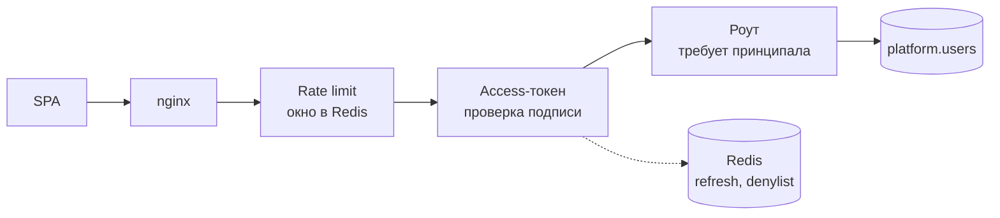
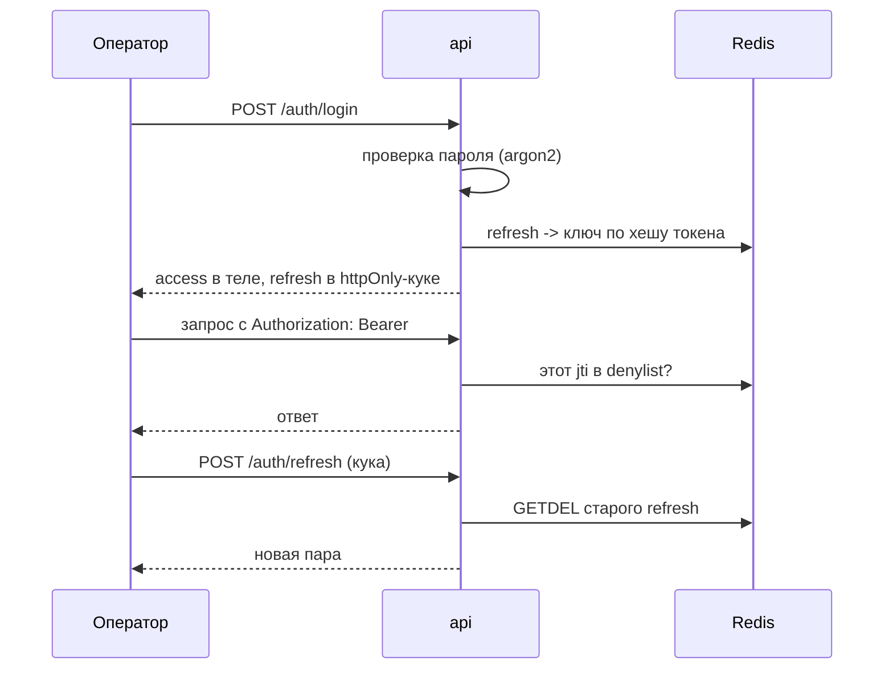
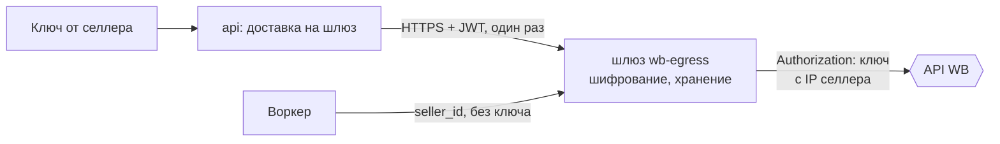

# Доступ и секреты

В системе три разные вещи, которые легко перепутать словом «авторизация»: вход сотрудника,
ключ селлера к WB и токен бота. Здесь живёт только первая: ключи селлеров — на шлюзе
wb-egress, токены ботов — на релее; ни того ни другого на этом сервере нет вовсе.

## Вход оператора



Проверка токена — **пассивная**: middleware разбирает заголовок, и если токен валиден и не
отозван, кладёт принципала в запрос. Требование авторизации — дело роута, а не middleware.
Так публичные эндпоинты (health, вход) не приходится перечислять исключениями в одном
списке, который забывают обновлять.

## Токены



| Токен | Где живёт | Срок | Как гасится |
| --- | --- | --- | --- |
| access (JWT) | в памяти SPA, заголовок `Authorization` | сутки | попадает в denylist до истечения |
| refresh | httpOnly-кука | неделя | удаляется из Redis при выходе |

**Refresh одноразовый.** При обновлении старый ключ удаляется атомарно (`GETDEL`), поэтому
повторное использование украденного токена не даёт ничего: первый же обмен его сжигает.
В Redis лежит не сам токен, а его хеш — дамп Redis не даёт войти.

**Denylist для access.** JWT сам по себе отозвать нельзя, поэтому при выходе `jti` кладётся
в Redis на остаток жизни токена, и middleware сверяется с ним.

**Ограничение попыток входа** — счётчик неудач по имени пользователя в окне. Считаем по
имени, а не по IP: подбор пароля одному оператору с разных адресов иначе не ловится.

**Redis отказывает открыто.** И denylist, и счётчик неудач при недоступном Redis
пропускают запрос. Обратное решение означало бы, что падение кеша выкидывает всех
операторов из системы; риск здесь несимметричный.

## Две роли, и только одна граница

`platform.users.is_admin` делит вошедших надвое: сотрудник работает с селлерами и
автоматизациями, администратор вдобавок заводит и блокирует учётные записи и подключает
ботов уведомлений. Внутри
рабочего интерфейса разделения нет — любой вошедший по-прежнему может всё, включая
безвозвратное удаление селлера.

Флаг **читается из базы на каждый админский запрос**, а не едет в токене. Лишний запрос
покупает мгновенность: access живёт сутки, и снятие прав через claim'ы догоняло бы
человека к завтрашнему дню. По этой же причине админские маршруты — единственное место,
где блокировка срабатывает сразу: `AuthService.current_user` сверяет `is_active` в той же
проверке.

Токен бота — единственный секрет, который проходит через сервер транзитом: из формы
админки он уходит на релей и здесь не сохраняется. Поэтому у приложения свой обработчик
ошибок валидации: стандартный вернул бы присланное значение обратно в теле `422`.

Администратор не может ни заблокировать себя, ни снять с себя флаг: последний
администратор иначе закрыл бы раздел, который единственный умеет выдавать права.

Первый администратор заводится только командой — раздел, который выдаёт флаг, сам за ним:

```
uv run python -m backend.commands.create_user --username ivanov --admin
```

Она же и аварийный выход, если администраторов не осталось:

```
uv run python -m backend.commands.grant_admin --username ivanov
```

**Пароли сотрудников генерирует сервер** — 24 символа, показываются один раз при заведении
и при сбросе. Форма, куда пароль вписывают руками, к концу недели содержит `qwerty12`;
восстановить показанный пароль нельзя, только выдать новый.

Админка живёт на отдельном поддомене. Бэкенд у неё общий с основным приложением, поэтому
границей служит nginx: на основном домене префикс `/api/v1/admin/` отдаёт `403`, а `/admin`
уводит редиректом на поддомен. Это второй рубеж поверх проверки в базе, а не замена ей.

## Что здесь заведомо слабо

- **Блокировка обычного оператора действует не сразу.** На рабочих маршрутах access-токен
  живёт сутки и с флагом активности не сверяется — заблокированный сотрудник доработает до
  истечения токена. Лечится версией токена в claim'ах и проверкой в middleware.
- **«Завершить все сессии» нечем.** Refresh-токены лежат по хешу самого токена, индекса по
  пользователю нет, поэтому найти все его сессии невозможно. Смена пароля по этой же причине
  чужие сессии не гасит.
- **Кто что сделал — не записывается.** Журнала действий администратора нет: на вопрос
  «кто снял права» ответа в системе не найти.

Свой пароль сотрудник меняет сам, зная текущий. Чужие сессии при этом не гаснут — см.
ниже, найти их нечем.

## Ключи селлеров

Это не про пользователя — это секрет, которым мы представляемся чужому API. **На этом
сервере он не хранится**: из формы админки ключ синхронно уезжает на шлюз wb-egress и
существует только там ([NETWORK_AND_EGRESS.md](NETWORK_AND_EGRESS.md),
[WB_EGRESS.md](WB_EGRESS.md)).



- Через этот сервер ключ проходит ровно один раз — при регистрации или ротации — и в
  базу, события Kafka, логи и ответы API не попадает.
- Воркеры и mcp адресуют селлера его `seller_id`; подстановка ключа — забота шлюза.
- Исход доставки виден в админке как статус селлера (`verified` / `key_invalid` /
  `no_free_ip` / `undelivered`).

**Токены ботов здесь не хранятся.** Они лежат на релее, который единственный обращается к
мессенджеру. Через этот сервер токен проходит ровно один раз — при регистрации бота, из
формы админки или из команды, — и уезжает на релей, не попадая ни в базу, ни в логи.
Смена токена — это повторная регистрация; перезапуск воркера ей больше не нужен.

## Периметр

TLS терминируется nginx на хосте, приложение слушает только `127.0.0.1`. Внутренняя сеть
compose закрыта наружу: база, Redis и Kafka портов на хост не публикуют. Реальный IP
клиента берётся из заголовка от нашего прокси и только когда явно включено доверие ему —
иначе ограничение частоты обходилось бы подделкой заголовка.
