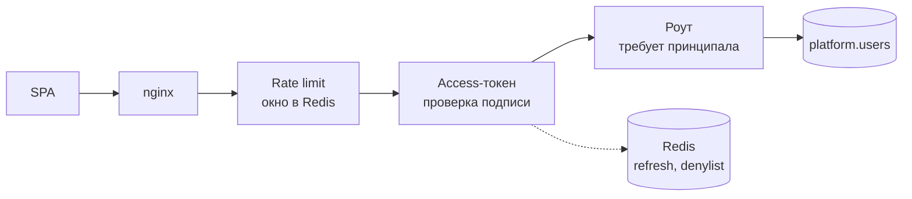
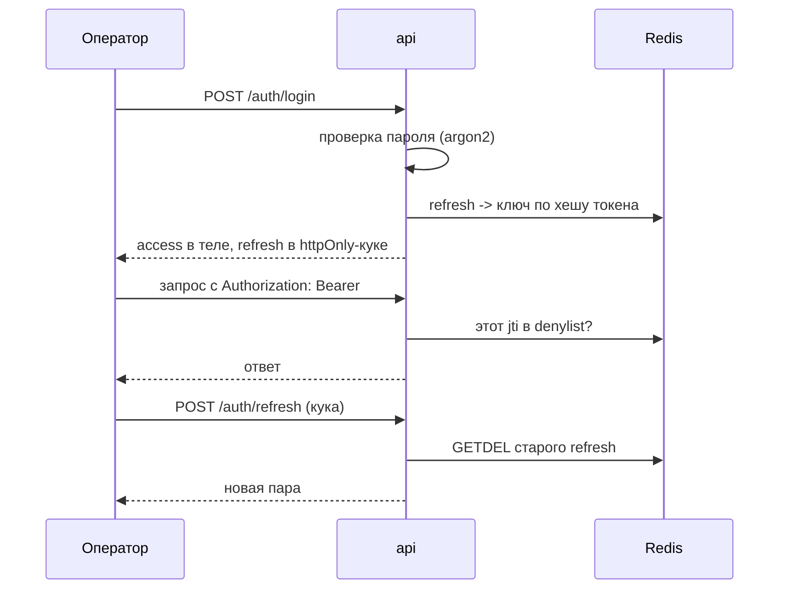
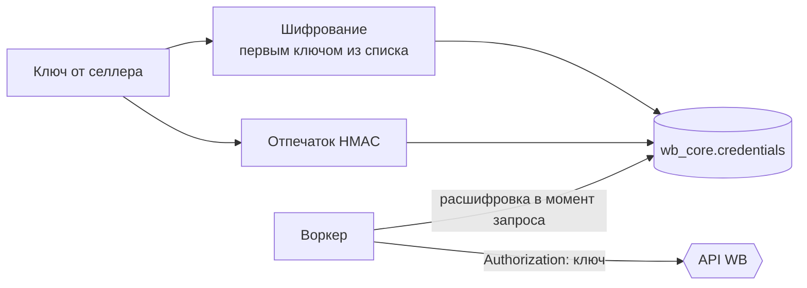

# Доступ и секреты

В системе три разные вещи, которые легко перепутать словом «авторизация»: вход оператора,
ключ селлера к WB и токен бота. Общего у них только хранилище.

## Вход оператора

Проверка токена — **пассивная**: middleware разбирает заголовок, и если токен валиден и не
отозван, кладёт принципала в запрос. Требование авторизации — дело роута, а не middleware.
Так публичные эндпоинты (health, вход) не приходится перечислять исключениями в одном
списке, который забывают обновлять.

## Токены

| Токен | Где живёт | Срок | Как гасится |
| --- | --- | --- | --- |
| access (JWT) | в памяти SPA, заголовок `Authorization` | сутки | попадает в denylist до истечения |
| refresh | httpOnly-кука | неделя | удаляется из Redis при выходе |

**Refresh одноразовый.** При обновлении старый ключ удаляется атомарно (`GETDEL`), поэтому
повторное использование украденного токена не даёт ничего: первый же обмен его сжигает.
В Redis лежит не сам токен, а его хеш — дамп Redis не даёт войти.

**Denylist для access.** JWT сам по себе отозвать нельзя, поэтому при выходе `jti` кладётся
в Redis на остаток жизни токена, и middleware сверяется с ним.

**Ограничение попыток входа** — счётчик неудач по имени пользователя в окне. Считаем по
имени, а не по IP: подбор пароля одному оператору с разных адресов иначе не ловится.

**Redis отказывает открыто.** И denylist, и счётчик неудач при недоступном Redis
пропускают запрос. Обратное решение означало бы, что падение кеша выкидывает всех
операторов из системы; риск здесь несимметричный.

## Что здесь заведомо слабо

- **Ролей нет.** Любой вошедший может всё, включая безвозвратное удаление селлера.
- **Блокировка оператора действует не сразу.** Access-токен живёт сутки и не сверяется с
  флагом активности — заблокированный сотрудник доработает до истечения токена. Лечится
  версией токена в claim'ах и проверкой в middleware.
- **«Завершить все сессии» нечем.** Refresh-токены лежат по хешу самого токена, индекса по
  пользователю нет, поэтому найти все его сессии невозможно.

## Ключи селлеров и токены ботов

Это не про пользователя — это секреты, которыми мы представляемся чужим API.

- Расшифровка происходит в момент обращения к WB и живёт в памяти процесса.
- Ключ никогда не попадает в события Kafka, в логи и в ответы API — наружу отдаётся
  только отпечаток и факт наличия ключа.
- Отпечаток уникален: он отвечает на вопрос «такой ключ уже заведён» без расшифровки.
- Список ключей шифрования допускает несколько значений: шифруем всегда первым,
  расшифровать может любой — на этом построена ротация, см. [KEY_ROTATION.md](../KEY_ROTATION.md).

Токены ботов устроены так же и хранятся в схеме уведомлений. Поллер расшифровывает токен
один раз при старте, поэтому смена токена требует перезапуска воркера уведомлений.

## Периметр

TLS терминируется nginx на хосте, приложение слушает только `127.0.0.1`. Внутренняя сеть
compose закрыта наружу: база, Redis и Kafka портов на хост не публикуют. Реальный IP
клиента берётся из заголовка от нашего прокси и только когда явно включено доверие ему —
иначе ограничение частоты обходилось бы подделкой заголовка.
