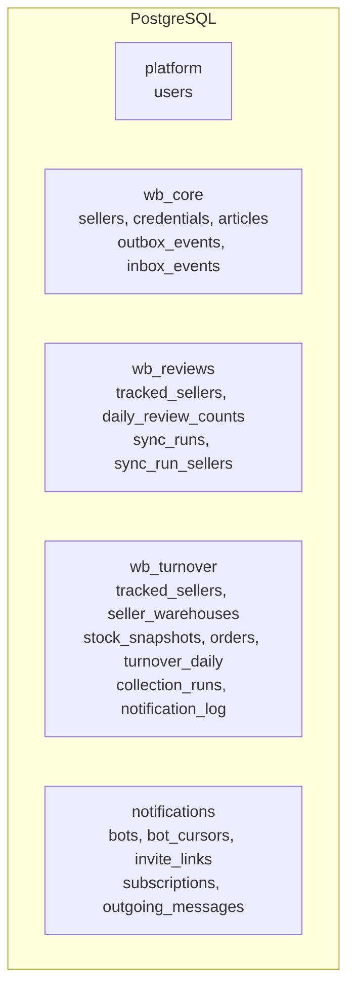

# Данные

Одна база PostgreSQL, пять схем — по схеме на модуль. Схема, а не отдельная база, потому
что модули живут в одном процессе и им нужна общая транзакция: событие в outbox обязано
попасть в ту же фиксацию, что и изменение, ради которого оно шлётся.

## Что где лежит

| Схема | Содержание | Кто пишет |
| --- | --- | --- |
| `platform` | операторы: логин, хеш пароля, активность | api |
| `wb_core` | реестр селлеров, зашифрованные ключи, каталог артикулов, outbox и inbox | api, каталог-консьюмер |
| `wb_reviews` | подключения, суточные снапшоты отзывов, прогоны и job'ы | воркер отзывов |
| `wb_turnover` | подключения, склады, снимки остатков, заказы, метрика, лог уведомлений | воркер оборачиваемости |
| `notifications` | боты, курсоры апдейтов, приглашения, подписки чатов, очередь исходящих | воркер уведомлений |

Схема автоматизации автономна: свои подключения (`tracked_sellers`), своя история, свои
прогоны. Реестр в неё не заглядывает и чистит её только через порт подключения.

## Миграции

У каждой схемы **своя цепочка** миграций и свой префикс ревизий (`p`, `wc`, `wr`, `wt`,
`nt`). Одна общая цепочка означала бы, что миграция автоматизации отзывов блокирует
миграцию уведомлений и что порядок между модулями зафиксирован навсегда.

Контейнер `migrate` прогоняет все цепочки до head и завершается; остальные сервисы
стартуют только после его успешного завершения. Поэтому «база отстала от кода» —
состояние, которого в проде не бывает: либо миграции прошли, либо приложение не поднялось.

## Секреты в базе

| Что | Где | Как |
| --- | --- | --- |
| Ключ API селлера | `wb_core.credentials` | Fernet-шифротекст + отпечаток HMAC |
| Токен бота | не хранится | живёт на релее вне РФ, сюда не попадает |

Отпечаток нужен, чтобы отвечать на вопрос «такой ключ уже заведён?» без расшифровки; он
уникален, и это единственная причина, по которой архивация селлера удаляет строку с
ключом — иначе завести того же селлера заново было бы нельзя. Процедура смены ключей
шифрования — [KEY_ROTATION.md](../KEY_ROTATION.md).

## Хранение и чистка

История не бесконечна: снимки остатков и заказы удаляются по возрасту в ежедневном
расчёте (по умолчанию 60 и 45 дней). Снапшоты отзывов живут дольше — на них строится ряд
«вчера против сегодня», и обрезать его нечем.

Записи о прогонах переживают удаление селлера намеренно: это журнал того, что
автоматизация делала той ночью, и API показывает job удалённого селлера как «Удалённый
селлер», а не прячет его.

## Что нельзя

- **Джойнить схемы между модулями.** Технически возможно, архитектурно запрещено: такой
  джойн — скрытая зависимость, которую не видно в интерфейсе модуля.
- **Держать в базе то, что можно спросить у WB.** Копируем только то, чего WB не отдаёт:
  историю остатков (её нет вообще) и суточные срезы отзывов (их нет в ретроспективе).
