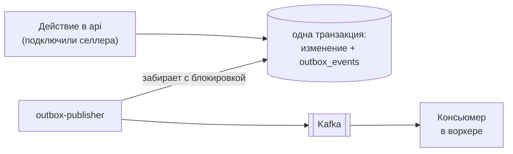

# События

Всё, что делается не сразу и не в том же процессе, едет через таблицу исходящих событий
и Kafka.

## Transactional outbox

Причина простая: отправить событие в Kafka и зафиксировать транзакцию нельзя атомарно.
Кто-то из двоих окажется первым, и система получит либо событие про изменение, которого
не было, либо изменение, о котором никто не узнал. Запись в ту же транзакцию убирает
выбор: событие существует ровно тогда, когда существует изменение.

Публикатор забирает события с временной блокировкой. Блокировка живёт дольше самой
медленной попытки отправки — иначе деградировавший брокер, который отвечает минуту,
успел бы отдать то же событие второму публикатору.

## Гарантии

**At least once.** Событие может приехать дважды: после сбоя между отправкой и отметкой
«опубликовано», после ребаланса Kafka, после ретрая. Поэтому **любой обработчик обязан
быть идемпотентным**, а таблица `inbox_events` отсекает повторную обработку по
идентификатору события.

**Оффсет коммитится всегда.** Повтор приезжает отдельным новым событием, а не повторной
обработкой того же сообщения. Иначе одна упавшая задача блокировала бы партицию, а вместе
с ней и всех остальных селлеров.

## Топики

| Топик | Кто шлёт | Кто читает |
| --- | --- | --- |
| `wb.catalog.sync.requested` | api при подключении и ручном ресинке | каталог-консьюмер |
| `wb.reviews.sync.requested` | ночной планировщик и reaper повторов | консьюмер отзывов |
| `notifications.telegram.message.requested` | автоматизации | воркер уведомлений |
| `storage.s3.*.upload` / `.delete` | код, которому нужно записать в S3 | подписчик хранилища |

Имена валидируются в реестре топиков, автосоздание на брокере выключено: недостающие
топики создаются на старте приложения из этого реестра. Опечатка в имени топика должна
падать при запуске, а не создавать тихо новый топик, который никто не читает.

Долгие обработчики (каталог селлера с тысячами карточек под троттлингом) поднимают
интервал поллинга Kafka: ребаланс в середине выкачки просто удвоил бы трафик к WB.

## Уведомления через событие

Автоматизация не отправляет сообщение — она публикует событие и называет **код бота**.
Кому уедет текст, решает модуль уведомлений по подпискам. Поэтому смена бота или чата не
требует правок в автоматизации, а недоступность Telegram не тормозит расчёт.

Консьюмер уведомлений только **складывает** строки в очередь исходящих; отправляет
отдельный цикл. Закоммиченный оффсет значит «мы должны этим чатам сообщение», а не
«отправлено».

## Правило для S3

- Читать из S3 и выдавать presigned GET можно откуда угодно.
- Любые `PUT` и `DELETE` идут событием в топик `storage.s3.<домен>.<действие>` и
  выполняются подписчиком; загрузка и удаление — разные топики и разные консьюмеры.
- В событиях никогда нет ключей, токенов и паролей.
- `content_base64` — только для мелких полезных нагрузок; большие выгрузки идут через
  промежуточное хранение или presigned upload.
- Оффсет коммитится после успешной операции в S3, поэтому обработчики обязаны быть
  идемпотентными.
