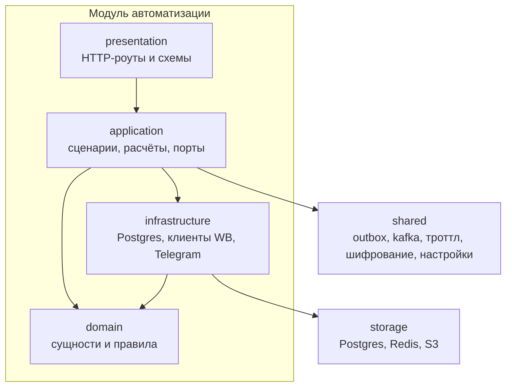
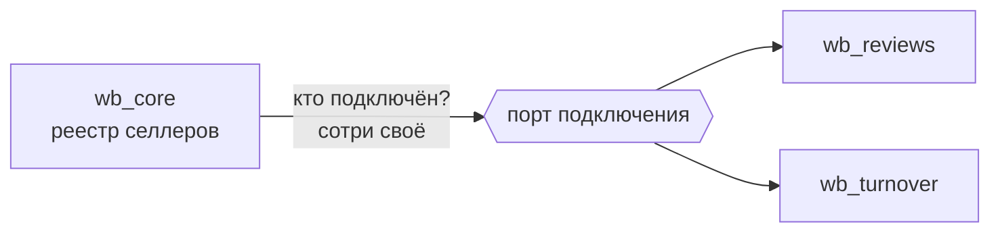

# Модули

Один процесс, внутри — независимые модули. Монолит выбран сознательно: автоматизации
делают ночные прогоны по десяткам селлеров, им нужна общая база и общий бюджет лимитов WB,
а не сеть между сервисами.

## Слои

Правило одно: **зависимость направлена внутрь**. `domain` не знает ни про SQLAlchemy, ни
про HTTP; `application` работает с портами, а не с конкретными клиентами. Поэтому расчёт
метрики тестируется без базы, а клиент WB подменяется в тестах целиком.

DTO и доменные модели лежат отдельно от роутов: когда они были в одном файле, HTTP-схема
незаметно становилась доменной моделью, и поменять ответ API без правки расчёта уже не
получалось.

## Кто есть кто

| Модуль | Отвечает за |
| --- | --- |
| `platform` | пользователи, вход, токены |
| `wb_core` | реестр селлеров, ключи, каталог артикулов |
| `wb_reviews` | автоматизация отзывов |
| `wb_turnover` | автоматизация оборачиваемости |
| `notifications` | боты, подписки, очередь и доставка сообщений |

`wb_core` — общий фундамент для автоматизаций: селлер и артикул нужны всем. Всё
остальное автоматизация держит у себя.

## Как модули общаются

**Через порт, а не через чужую таблицу.** Раньше реестр селлеров при удалении сам делал
`DELETE` из схемы отзывов сырым запросом — каждый новый модуль пришлось бы дописывать в
этот запрос руками, и забыть это было проще, чем сделать.

Сейчас модуль автоматизации реализует порт подключения (`seller_ids` / `attach` /
`detach` / `purge`) и регистрируется в DI одной строкой. Реестр спрашивает у всех, кто
зарегистрирован, и не знает, у кого что внутри.

**Через событие, когда действие асинхронное.** Подключили селлера — в ту же транзакцию
падает событие, каталог синхронизируется потом и в другом процессе. Подробности —
[EVENTS.md](EVENTS.md).

## Сборка

Зависимости собираются в DI-контейнере: приложение отдаёт настройки, базу, Redis и
продюсер Kafka, контейнер выдаёт репозитории и сервисы — на приложение либо на запрос.
Новый модуль подключается регистрацией провайдера; ни одна автоматизация не упоминается в
коде другой.

## Что это значит на практике

- Новая автоматизация — это новая схема в базе, свой набор слоёв, свой порт подключения
  и своя строка в каталоге автоматизаций. Трогать существующие модули не нужно.
- Если для новой фичи хочется прочитать чужую таблицу — это сигнал, что нужен порт.
- Общий код едет в `shared` только когда он действительно общий: троттлинг WB, outbox,
  шифрование, настройки, heartbeat.
