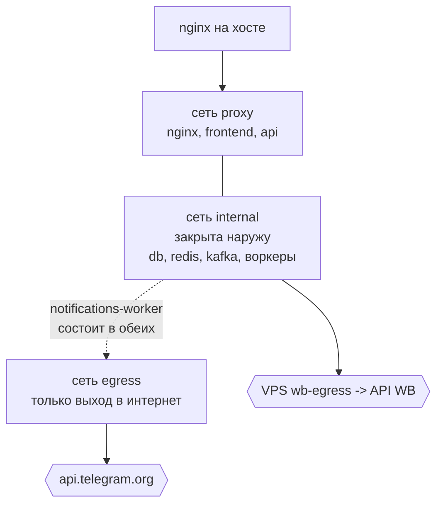
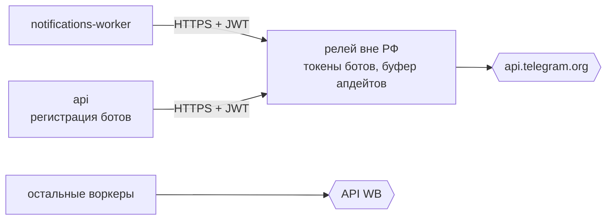
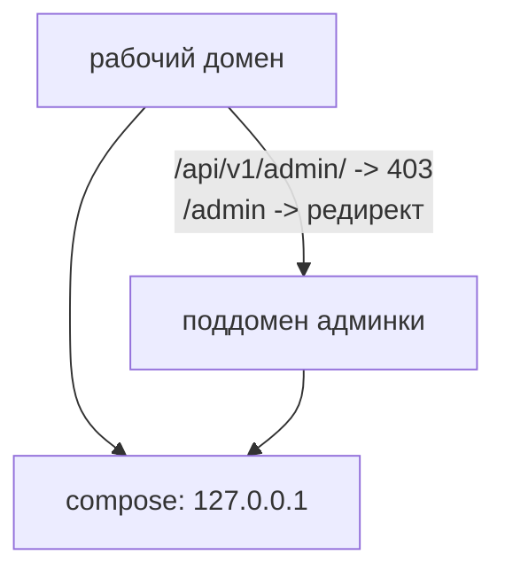

# Сети и исходящий трафик

Главное правило: **разные внешние системы требуют разного исходящего IP**, поэтому
«завернуть весь трафик» — не вариант ни в одну сторону.

| Куда | С какого адреса | Почему |
| --- | --- | --- |
| API Wildberries | закреплённый IP селлера на VPS wb-egress | лимиты и антифрод WB считаются по адресу |
| api.telegram.org | адрес релея вне РФ | с прод-сервера Telegram недоступен |

## Сети compose

Сеть `internal` помечена внутренней: контейнеры в ней не имеют маршрута наружу через
docker-мост и портов на хост не публикуют. Наружу ходят только те сервисы, которым это
нужно по делу.

## Релей для мессенджера

С прод-сервера `api.telegram.org` недоступен: TCP-соединение не устанавливается ни по
IPv4, ни по IPv6. Трассировка показывает, что пакеты доходят до пограничного маршрутизатора
провайдера и дальше не идут, при этом WB и остальной интернет из тех же контейнеров
доступны. Файрвол сервера и docker-сети ни при чём — из-под VPN тот же запрос проходит.

Решение — **отдельный сервис-релей на площадке вне РФ**. Он единственный, кто
обращается к мессенджеру, и единственный, кто хранит токены ботов. Где именно он
стоит и по какому адресу доступен — вопрос эксплуатации, а не архитектуры: это
живёт в `.env` и в его собственном репозитории.

К релею ходят двое. Воркер уведомлений — постоянно: забирает апдейты и отдаёт сообщения.
`api` — только когда администратор регистрирует или удаляет бота: токен нужно передать
туда, где он будет жить, а обратно приходят заголовок бота и шаблон ссылки-приглашения.

Почему сервис, а не прокси, которым это решалось в первом варианте:

- **Токены ботов не должны лежать на сервере в РФ.** Прокси эту задачу не решает: он видит
  только TLS-туннель, но токен остаётся в нашей базе. Релей забирает токены целиком.
- **Мессенджер становится сменяемым.** Всё, что знает про Telegram — адрес API, формат
  апдейтов, вид `t.me`-ссылки, — заперто в одном файле релея. На основном сервере нет ни
  одного обращения к мессенджеру: бот адресуется кодом, чат — непрозрачной строкой.

### Направление всегда одно

**Инициатор соединения — всегда основной сервер, в обе стороны.** С площадки релея наш
сервер недоступен: его хостинг режет входящие с иностранных адресов, ровно как это
делает `wildberries.ru`. Проверено с самой машины — до других российских сайтов с неё же
достучаться получается, так что дело не в маршруте.

Поэтому апдейты не приносят, а забирают: релей копит их у себя, а воркер уведомлений
спрашивает `GET /api/v1/updates?after=<курсор>` и держит запрос, пока в канале тихо. Курсор
в Postgres — единственный источник правды, подтверждений в протоколе нет: потерянный ответ
стоит повторной выдачи, а не потерянного апдейта.

Схемы, где релей ходит на основной сервер, не работают — проверено, не предлагать.

### Канал

- **TLS с самоподписанным сертификатом релея**, запиненным на нашей стороне
  (`RELAY_VERIFY` указывает на файл). Публичный УЦ здесь не нужен и оставил бы след в
  Certificate Transparency; публичной DNS-записи на релей тоже нет — имя резолвится
  внутри контейнеров записью `extra_hosts` из `.env`, поэтому адрес релея не лежит ни в
  репозитории, ни в чужом DNS.
- **Allowlist по IP** на хостовом nginx релея и в ufw — сетевой рубеж первый, JWT второй.
- **JWT (HS256) с общим секретом**, TTL 5 минут. Аудитории для двух направлений разные,
  иначе токен, выпущенный для похода на релей, работал бы и в обратную сторону.
- **Идемпотентный ключ на отправку** — идентификатор строки в очереди исходящих. Повтор
  после потерянного ответа релей узнаёт сам, и сообщение не приходит в чат дважды.
- **VPN не используется.** Между серверами не ходит ничего блокируемого, а WireGuard из РФ
  сам по себе нестабилен: это добавило бы отказ там, где его сейчас нет.

## Исходящие IP для WB

Реализовано **закрепление**, а не ротация: отдельная VPS `wb-egress` с шестью
дополнительными адресами, по одному на селлера; там же живут ключи селлеров и
троттлинг. Прямых обращений к `*.wildberries.ru` с прод-сервера больше нет — все
WB-запросы обоих сервисов уходят на шлюз. Подробности — [WB_EGRESS.md](WB_EGRESS.md).

## Публичный контур

nginx на хосте терминирует TLS и проксирует на локальный порт compose; внутренний nginx
раздаёт собранный SPA и отправляет `/api` в приложение. Сертификаты живут на сервере и в
репозиторий не попадают.

**Доменов два: рабочий и админский.**

Бэкенд и сборка SPA у них общие, разный только вход: на рабочем домене админский префикс
API закрыт наглухо, а `/admin` уводит редиректом на поддомен. Это сетевой рубеж поверх
проверки прав в базе, а не вместо неё — [AUTH.md](AUTH.md). Фронтенд узнаёт, где он, по
имени хоста, поэтому локально оба интерфейса живут на одном адресе и админка ведёт себя
как обычный маршрут.

**Домены не хранятся в репозитории.** В нём лежат шаблоны хостовых конфигов, а готовые
файлы существуют только на сервере: скрипт рендеринга подставляет в них значения из
`.env` и перезагружает nginx. Хостовой nginx деплоем не обновляется — этот скрипт и есть
способ его обновить.

Третий шаблон, `bootstrap`, рендерится, но не включается: он нужен на время выпуска
сертификата, когда TLS-конфиг ещё не может подняться, и включается руками.

Внутренний nginx отдаёт хешированные бандлы с вечным кешем, а `index.html` — с запретом
кеша: он единственный знает имена бандлов, и закешированная копия переживала бы деплой,
ссылаясь на файлы, которых уже нет. Отсутствующий бандл честно отвечает `404`, а не
проваливается в `index.html` — иначе браузер получал бы HTML вместо скрипта и показывал
белый экран.
