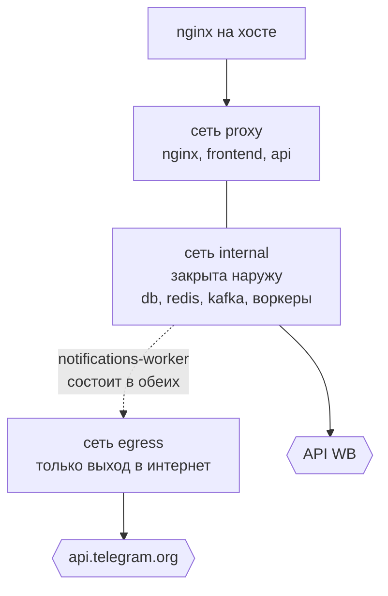
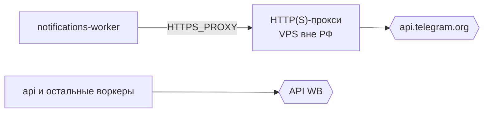

# Сети и исходящий трафик

Главное правило: **разные внешние системы требуют разного исходящего IP**, поэтому
«завернуть весь трафик» — не вариант ни в одну сторону.

| Куда | С какого адреса | Почему |
| --- | --- | --- |
| API Wildberries | российский IP нашего сервера | иностранный адрес — риск поведения антифрода WB |
| api.telegram.org | адрес VPS вне РФ | с прод-сервера Telegram недоступен |

## Сети compose

Сеть `internal` помечена внутренней: контейнеры в ней не имеют маршрута наружу через
docker-мост и портов на хост не публикуют. Наружу ходят только те сервисы, которым это
нужно по делу.

## Прослойка для Telegram

С прод-сервера `api.telegram.org` недоступен: TCP-соединение не устанавливается ни по
IPv4, ни по IPv6. Трассировка показывает, что пакеты доходят до пограничного маршрутизатора
провайдера и дальше не идут, при этом WB и остальной интернет из тех же контейнеров
доступны. Файрвол сервера и docker-сети ни при чём, токен бота рабочий — из-под VPN тот же
запрос проходит.

Решение — HTTP(S)-прокси на VPS вне РФ, включённый **только** для воркера уведомлений:

Почему именно так:

- **Воркер уведомлений — единственный процесс, который ходит в Telegram по HTTP.** Прокси,
  включённый только для него, физически не может задеть трафик к WB.
- **Правок кода не требуется.** HTTP-клиент доверяет переменным окружения, поэтому
  включение сводится к одной переменной в `.env` и перезапуску одного контейнера. Пустое
  значение переменной означает «прокси нет» — локальная и тестовая среда ничего не знают
  про VPS.
- **Внутренние адреса исключены из проксирования** списком без прокси: база, Redis и Kafka
  живут в docker-сети, гонять их через заграницу было бы бессмысленно и опасно.

Требования к самому прокси:

- **Авторизация и файрвол на IP нашего сервера.** Открытый прокси находят за сутки.
- **Таймаут не меньше 60 секунд.** Long polling держит соединение 25 секунд, прокси с
  таймаутом в 10 будет рвать каждый запрос за апдейтами.
- **HTTP(S), не SOCKS5** — SOCKS требует отдельной зависимости у HTTP-клиента, которой
  сейчас нет.

Состояние: compose и конфигурация готовы, VPS не арендован — уведомления в Telegram до
этого момента не работают, регистрация бота падает на первом же обращении к Telegram.

## Ротация исходящих IP для WB (замысел)

WB считает бюджет запросов на пару «категория API + токен», но на части методов ещё и
прижимает по адресу, а все наши запросы уходят с одного IP. Замысел — несколько VPS с
российскими адресами и выбор адреса как часть общего троттла: вёдра лимитов уже живут в
Redis и общие для всех воркеров, поэтому выбор IP и списание бюджета должны жить в одном
месте, иначе они разъедутся. Ничего из этого пока не реализовано.

## Публичный контур

nginx на хосте терминирует TLS и проксирует на локальный порт compose; внутренний nginx
раздаёт собранный SPA и отправляет `/api` в приложение. Сертификаты живут на сервере и в
репозиторий не попадают.
