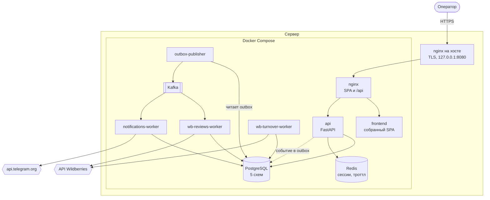

# Контур целиком

## Процессы

| Процесс | Зачем | Реплик |
| --- | --- | --- |
| `api` | HTTP для SPA: селлеры, автоматизации, отзывы, оборачиваемость, вход | сколько угодно |
| `wb-reviews-worker` | ставит ночной прогон отзывов, чинит зависшие job'ы, слушает Kafka | 1 (расписание) |
| `wb-turnover-worker` | снимки остатков, догрузка заказов, расчёт, дайджест | 1 (расписание) |
| `notifications-worker` | поллинг ботов, очередь исходящих, отправка в Telegram | **строго 1** |
| `outbox-publisher` | переносит события из таблицы outbox в Kafka | 1 |
| `migrate` | прогоняет миграции всех схем и завершается | одноразовый |
| `pg-backup` | суточные дампы базы | 1 |

`notifications-worker` в единственном экземпляре не по соображениям нагрузки: Telegram
отвечает `409` на второй `getUpdates` с тем же токеном, и апдейты перестают приходить
обоим. Это ограничение на токен, а не на процесс, поэтому масштабирование здесь — это
отдельный сервис с другими ботами, а не вторая реплика.

## Где какие решения приняты

- Почему всё в одном процессе-монолите и как модули не срастаются — [MODULES.md](MODULES.md).
- Почему база одна, а схем пять — [DATA.md](DATA.md).
- Почему автоматизация не отправляет сообщение сама, а кладёт событие — [EVENTS.md](EVENTS.md).
- Почему воркеры не ходят в Telegram напрямую с прод-сервера — [NETWORK_AND_EGRESS.md](NETWORK_AND_EGRESS.md).

## Что снаружи

**Wildberries** — четыре группы API с раздельными бюджетами лимитов: контент (каталог),
отзывы, статистика (остатки FBO, заказы), маркетплейс (остатки FBS). Ходим только на
чтение. Подробности про лимиты — [WB_API.md](WB_API.md).

**Telegram** — исходящие сообщения и long polling ботов. Единственная внешняя система,
куда мы что-то отправляем.

Больше внешних зависимостей нет: S3 подключается опционально и сейчас выключен.

## Границы, которые держим

- **Автоматизация не знает про чаты.** Она кладёт событие и называет бота по коду;
  кому это уедет, решает модуль уведомлений.
- **Модуль не ходит в чужую схему.** Реестр селлеров спрашивает автоматизации через порт,
  а не удаляет их данные сам.
- **Секреты не покидают базу в открытом виде.** Ключи WB и токены ботов расшифровываются
  в момент запроса и никогда не попадают ни в события Kafka, ни в логи, ни в API.
