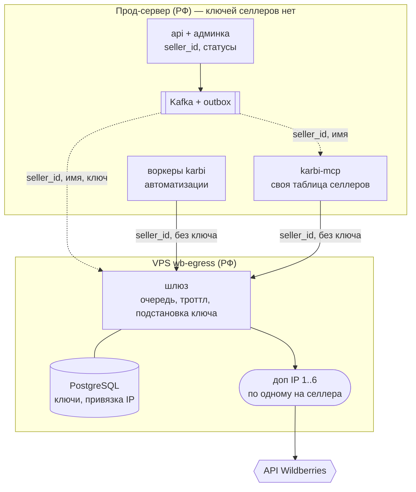
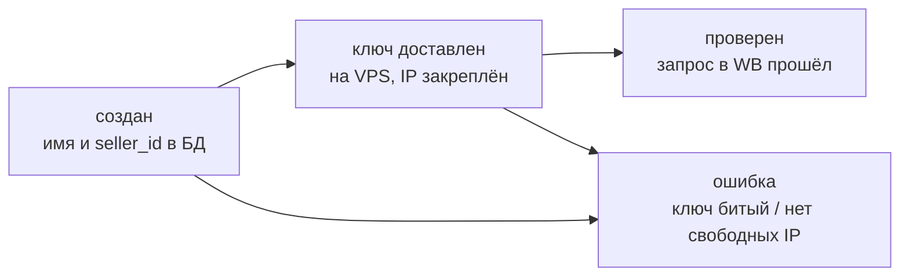

# VPS wb-egress: ключи селлеров и исходящие IP

Статус: **принято, не реализовано**. Этот документ — целевая картина; по мере
реализации расхождения правятся здесь же.

WB прижимает лимиты не только по токену, но на части методов и по адресу, а весь наш
трафик уходит с одного IP прод-сервера. Решение — отдельная VPS `wb-egress` (РФ) с шестью
дополнительными адресами: **за каждым селлером навсегда закреплён один из них**, и все
запросы селлера — из karbi и из mcp — уходят только с него.

Вместе с точкой выхода туда переезжают и ключи: на прод-сервере ключей селлеров
**не остаётся вовсе** — тот же ход, что с токенами ботов на телеграм-релее. Дамп основной
базы перестаёт быть ценностью, а ротация и отзыв ключа делаются в одном месте.

## Целевая картина

Сплошные стрелки — WB-трафик, пунктирные — контур управления селлерами.

## Идентичность: seller_id

Единственный общий идентификатор селлера в системе — неизменяемый `seller_id`,
который выпускает админка при регистрации. Он один и тот же в karbi, mcp и на VPS;
им ключуются события, вёдра лимитов и обращения к шлюзу. Имя — косметика: оно
синхронизируется теми же событиями, но идентификатором не является и может меняться.

Хеш ключа (`scope_for_key`) в роли общего идентификатора умирает вместе с раздачей
ключей: на проде больше нечего хешировать.

## Адреса

| Адрес | Роль |
| --- | --- |
| основной IP VPS | только вход: SSH и порт шлюза; в WB не ходит и селлерам не назначается никогда |
| доп IP 1–6 | только исходящие в WB, каждый закреплён за одним селлером навсегда |

Свободный адрес выбирает шлюз в момент регистрации селлера и записывает привязку в свою
базу. Нет свободных — регистрация отклоняется, и отказ доезжает до статуса селлера в
админке, а не оседает в логах. Запрос за селлера без привязки — отказ, не случайный
адрес: селлер не должен засветиться со второго IP ни при какой ошибке конфигурации.

## Шлюз

Запрос приходит с прода: `seller_id`, категория API, метод, путь, тело — без ключа.
Шлюз достаёт ключ из своей базы, ставит запрос в очередь, по бюджету выпускает его в WB
с закреплённого IP и возвращает ответ как есть, включая заголовки `X-Ratelimit-*`.

**Троттлинг живёт только здесь.** Логика — сегодняшний `WBThrottle` (вёдра
per-категория+селлер, чтение лимитов из ответов WB), только вёдра переезжают в Redis на
VPS. На проде WB-троттла не остаётся ни в karbi, ни в mcp — вместе с ним умирает и
overlay `compose.karbi.yaml`, которым mcp подключался к Redis karbi. Redis на проде
остаётся только rate-limiter'ом входящих запросов к самому karbi.

Когда бюджета нет, шлюз держит запрос в очереди до N секунд, дальше отвечает
`429 + Retry-After`: воркеры умеют ретраиться, а менеджер в Claude не висит вечно.
В очереди два класса приоритета — интерактивные запросы mcp обгоняют фоновые
автоматизации, иначе ночной синк каталога ставит менеджеров в конец очереди.

## Ключи

Ключи лежат в PostgreSQL на VPS, зашифрованные приложением шлюза. Ключ шифрования — в
`.env` на VPS: не в базе и **не в бэкапе базы**, иначе бэкап равен ключам в открытом
виде. Бэкапы базы обязательны — потеря диска VPS без них означает перевыпуск ключей у
всех селлеров.

## Контур управления

Регистрация, ротация ключа, переименование и отключение селлера едут через существующий
transactional outbox и Kafka ([EVENTS.md](EVENTS.md)). До VPS Kafka не дотягивается —
брокер живёт в закрытой сети — поэтому консьюмеры на проде доставляют события по сети
дальше: в mcp — `seller_id` и имя, на VPS — `seller_id`, имя и ключ. Канал до VPS — тот
же набор, что у релея: allowlist по IP прода, HTTPS, JWT с коротким TTL.

Партиционирование по `seller_id` даёт порядок событий в пределах селлера; доставка —
идемпотентный upsert с версией события, чтобы поздний ретрай «создания» не затёр свежее
переименование.

**Регистрация — сага со статусами.** Проверить ключ может только VPS, причём сразу с
назначенного адреса, поэтому подключение асинхронно, и админка показывает статус:

Ключ в базу karbi не пишется вообще — из транзакции регистрации он попадает только в
outbox-событие и после доставки на VPS существует только там.

## Что меняется в сервисах

- **karbi**: WB-клиенты адресуют шлюз и передают `seller_id` вместо ключа; зашифрованные
  ключи из `wb_core` удаляются; `WBThrottle` и его Redis-вёдра выпиливаются; админка
  ведёт сагу регистрации.
- **karbi-mcp**: Vault, подстановка ключа и копия троттла выезжают на VPS; остаётся
  тонкий адаптер — auth менеджеров, MCP-инструменты и собственная таблица
  `seller_id → имя`, пополняемая событиями. Сервис перестаёт быть stateless — у таблицы
  появляется хранилище и бэкап.
- **VPS wb-egress**: новый сервис в отдельном репозитории; основа — сегодняшний код
  mcp-шлюза (проксирование, allowlist WB-хостов, троттл), плюс PostgreSQL и очередь.

## Цена

Единая точка отказа на весь WB-контур: падение VPS останавливает и автоматизации, и
работу менеджеров одновременно. Это принято осознанно. Запасного пути «напрямую с
прода» нет и не будет — он ломает закрепление адресов, ради которого всё затевалось.

## Порядок внедрения

1. Шлюз на VPS: PostgreSQL, очередь, троттл; ключи заливаются руками.
2. Переезд mcp: запросы через шлюз, таблица селлеров, отключение Vault.
3. Переезд клиентов karbi на `seller_id` и шлюз.
4. Удаление ключей из БД karbi, троттла и overlay; сага регистрации в админке.
5. Актуализация [NETWORK_AND_EGRESS.md](NETWORK_AND_EGRESS.md) по факту.
