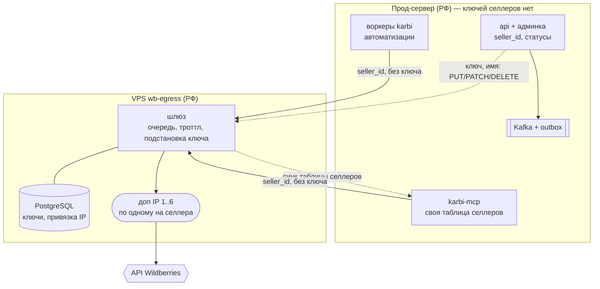
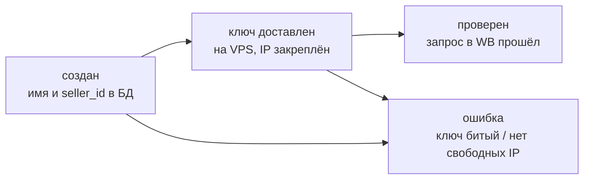

# VPS wb-egress: ключи селлеров и исходящие IP

Статус: **реализовано**. Шлюз развёрнут, оба сервиса ходят в WB только через
него, ключей селлеров на прод-сервере не осталось.

Через тот же шлюз с тех же адресов ходит и Ozon — см. [OZON_API.md](OZON_API.md).
Ниже описан WB-контур; для Ozon в нём меняются только учётки (у каждого маркетплейса
своя таблица на шлюзе и свой статус) и то, что админка karbi Ozon пока не заводит.

WB прижимает лимиты не только по токену, но на части методов и по адресу, а весь наш
трафик уходит с одного IP прод-сервера. Решение — отдельная VPS `wb-egress` (РФ) с шестью
дополнительными адресами: **за каждым селлером навсегда закреплён один из них**, и все
запросы селлера — из karbi и из mcp — уходят только с него.

Вместе с точкой выхода туда переезжают и ключи: на прод-сервере ключей селлеров
**не остаётся вовсе** — тот же ход, что с токенами ботов на телеграм-релее. Дамп основной
базы перестаёт быть ценностью, а ротация и отзыв ключа делаются в одном месте.

## Картина

Сплошные стрелки — WB-трафик, пунктирные — контур управления селлерами.

## Идентичность: seller_id

Единственный общий идентификатор селлера в системе — неизменяемый `seller_id`,
который выпускает админка при регистрации. Он один и тот же в karbi, mcp и на VPS;
им ключуются события, вёдра лимитов и обращения к шлюзу. Имя — косметика: оно
синхронизируется теми же событиями, но идентификатором не является и может меняться.

Хеш ключа (`scope_for_key`) в роли общего идентификатора умирает вместе с раздачей
ключей: на проде больше нечего хешировать.

## Адреса

| Адрес | Роль |
| --- | --- |
| основной IP VPS | только вход: SSH и порт шлюза; в WB не ходит и селлерам не назначается никогда |
| доп IP 1–6 | только исходящие в WB, каждый закреплён за одним селлером навсегда |

Свободный адрес выбирает шлюз в момент регистрации селлера и записывает привязку в свою
базу. Нет свободных — регистрация отклоняется, и отказ доезжает до статуса селлера в
админке, а не оседает в логах. Запрос за селлера без привязки — отказ, не случайный
адрес: селлер не должен засветиться со второго IP ни при какой ошибке конфигурации.

## Шлюз

Запрос приходит с прода: `seller_id`, категория API, метод, путь, тело — без ключа.
Шлюз достаёт ключ из своей базы, ставит запрос в очередь, по бюджету выпускает его в WB
с закреплённого IP и возвращает ответ как есть, включая заголовки `X-Ratelimit-*`.

**Троттлинг живёт только здесь.** Логика — сегодняшний `WBThrottle` (вёдра
per-категория+селлер, чтение лимитов из ответов WB), только вёдра переезжают в Redis на
VPS. На проде WB-троттла не остаётся ни в karbi, ни в mcp — вместе с ним умирает и
overlay `compose.karbi.yaml`, которым mcp подключался к Redis karbi. Redis на проде
остаётся только rate-limiter'ом входящих запросов к самому karbi.

Когда бюджета нет, шлюз держит запрос в очереди до N секунд, дальше отвечает
`429 + Retry-After`: воркеры умеют ретраиться, а менеджер в Claude не висит вечно.
В очереди два класса приоритета — интерактивные запросы mcp обгоняют фоновые
автоматизации, иначе ночной синк каталога ставит менеджеров в конец очереди.

## Ключи

Ключи лежат в PostgreSQL на VPS, зашифрованные приложением шлюза. Ключ шифрования — в
`.env` на VPS: не в базе и **не в бэкапе базы**, иначе бэкап равен ключам в открытом
виде. Бэкапы базы обязательны — потеря диска VPS без них означает перевыпуск ключей у
всех селлеров.

## Контур управления

Замысел вёл жизненный цикл селлера через outbox и Kafka, но от этого пришлось отойти в
одном месте, и это потянуло упрощение остальных: **ключ не может ехать событием** —
retention брокера хранил бы его в открытом виде дольше, чем он живёт в памяти процесса.
Поэтому доставка устроена так:

- **Ключ** (создание, ротация, восстановление) — синхронный вызов шлюза прямо из
  запроса админки: `PUT /api/v1/sellers/{seller_id}` по HTTPS с пиннингом и JWT.
  Исход — статус на селлере; при недоступном шлюзе селлер остаётся `undelivered`,
  и ключ вводится повторно.
- **Переименование и отключение** — те же синхронные вызовы (`PATCH`/`DELETE`);
  неудача помечает селлера `unsynced`, расхождения добирает сверка
  `backend/commands/sync_egress_status.py`, читающая состояние шлюза целиком.
- **Kafka остаётся гарантом там, где ключей нет** — каталог-синк по-прежнему едет
  через outbox ([EVENTS.md](EVENTS.md)).

Идемпотентность на шлюзе — та же: upsert с монотонной `event_version`, поздний повтор
ничего не затирает. mcp таблицу селлеров пополняет фоновым синком со шлюза (TTL 5 мин),
отдельного контура событий ему не понадобилось.

**Регистрация — сага со статусами.** Проверить ключ может только VPS, причём сразу с
назначенного адреса; админка показывает исход как статус селлера:

Ключ в базу karbi не пишется вообще — из запроса регистрации он уезжает на шлюз и
существует только там.

## Что меняется в сервисах

- **karbi**: WB-клиенты адресуют шлюз и передают `seller_id` вместо ключа; зашифрованные
  ключи из `wb_core` удаляются; `WBThrottle` и его Redis-вёдра выпиливаются; админка
  ведёт сагу регистрации.
- **karbi-mcp**: Vault, подстановка ключа и копия троттла выезжают на VPS; остаётся
  тонкий адаптер — auth менеджеров, MCP-инструменты и собственная таблица
  `seller_id → имя`, пополняемая синком со шлюза. Сервис перестаёт быть stateless — у
  таблицы появляется хранилище.
- **VPS wb-egress**: новый сервис в отдельном репозитории; основа — сегодняшний код
  mcp-шлюза (проксирование, allowlist WB-хостов, троттл), плюс PostgreSQL и очередь.

## Цена

Единая точка отказа на весь WB-контур: падение VPS останавливает и автоматизации, и
работу менеджеров одновременно. Это принято осознанно. Запасного пути «напрямую с
прода» нет и не будет — он ломает закрепление адресов, ради которого всё затевалось.

## Как внедрялось

1. Шлюз на VPS (репозиторий karbi-wb-egress): PostgreSQL, очередь, троттл, CI/CD.
2. Ключи перелиты с прода командой (упразднена после миграции) — прод → VPS напрямую,
   без посредников; `seller_id` — родные UUID из `wb_core.sellers`.
3. karbi-mcp переведён на шлюз; Vault и overlay с Redis karbi удалены.
4. Воркеры и админка karbi переведены на `seller_id`; локальный троттл, шифрование и
   `wb_core.credentials` удалены (миграция `wc005`).
