# Фоновые процессы

Десять долгоживущих процессов. Каждый — цикл: проснуться, посмотреть, что пора, сделать,
уснуть до следующей итерации.

```mermaid
flowchart TB
    subgraph reviews["wb-reviews-worker"]
        r1["планировщик<br/>ставит ночной прогон"]
        r2["reaper<br/>чинит зависшие job'ы"]
        r3["консьюмер отзывов"]
    end
    subgraph core["wb-core-worker"]
        k1["зеркало WB по всем селлерам:<br/>каталог, остатки, отзывы,<br/>задания и поставки FBS, чаты"]
        k2["консьюмер каталога<br/>по событию реестра"]
    end
    subgraph turnover["wb-turnover-worker"]
        t1["слоты остатков"]
        t2["догрузка заказов"]
        t3["расчёт и чистка"]
        t4["дайджест"]
    end
    subgraph notify["notifications-worker"]
        n1["супервизор ботов"]
        n2["забор апдейтов у релея<br/>цикл на бота"]
        n3["доставка через релей<br/>цикл на бота"]
        n4["консьюмер очереди"]
    end
    subgraph fbs["wb-fbs-distribution-worker"]
        f1["сверка складов кабинета"]
    end
    subgraph checklist["wb-card-checklist-worker"]
        c1["карточки, цены, справочник"]
        c2["кнопка «Обновить»"]
    end
    subgraph stocks["wb-fbs-stocks-worker"]
        s1["склады и остатки раз в час"]
        s2["кнопка «Обновить»"]
    end
    subgraph penalties["wb-fbs-penalties-worker"]
        p1["суточные фин. отчёты каждые два часа"]
        p2["кнопка «Обновить»"]
    end
    subgraph returns["wb-returns-worker"]
        rt1["отчёт о возвратах и заявки<br/>каждые 10 минут"]
        rt2["уведомления: готово, дайджест,<br/>напоминания, заявки"]
        rt3["кнопка «Обновить»"]
    end
    outbox["outbox-publisher"]
```



## Расписание

| Когда (МСК) | Что |
| --- | --- |
| 00:30 | создаётся прогон отзывов |
| 02:30 | зеркало: каталог всех активных селлеров |
| 03:00 / 09:00 / 15:00 / 21:00 | зеркало: остатки по карточкам; снимки остатков оборачиваемости |
| 04:00 | зеркало: отзывы по карточкам |
| 05:00 | зеркало: поставки FBS, склады продавца, объекты WB |
| каждые полчаса | зеркало: лента чатов с покупателями от сохранённого курсора; первая загрузка истории — порциями |
| каждый час | зеркало: сборочные задания FBS — свежие перечитываются, пока не лягут в поставку; архив старше трёх месяцев дочитывается помесячно |
| 03:20 | догрузка заказов от watermark |
| 03:40 | расчёт оборачиваемости и чистка истории |
| 05:00 | чек-лист: карточки и цены; повтор через час после неудачи |
| каждые 2 часа | штрафы FBS: список суточных фин. отчётов за две недели, детализация новых; повтор через 10 минут |
| каждые 10 минут | возвраты WB: отчёт о возвратах за две недели и открытые заявки; архив заявок раз в 6 часов; после сбора — «готовы к выдаче» и новые заявки в Telegram |
| 09:00 | возвраты WB: дайджест того, что едет в ПВЗ; напоминания на 3-й и 5-й день хранения проверяются каждый проход |
| 10:00 | дайджест по оборачиваемости в Telegram |
| каждый час | остатки FBS по складам: кабинеты, у которых последний сбор старше часа |

Проверка «пора ли» сравнивает час **и минуту**: для часа `0` сравнение только по часам не
срабатывало никогда.

## Два способа не потерять работу

Автоматизации решают одну задачу по-разному, и это осознанно.

**Отзывы — job'ы с лизингом.** Полное сканирование селлера идёт десятки минут, поэтому
работа разбита на job'ы, у каждого есть аренда и счётчик попыток. Временная ошибка
возвращает job в очередь с backoff; reaper переотправляет его **новым** событием, поэтому
приёмник не глотает повтор как дубль, а партиция Kafka не блокируется. Прогон старше
предельного возраста закрывается принудительно — иначе зависший job навсегда блокирует
создание новых прогонов.

**Оборачиваемость — уникальный слот.** Шаг здесь — пара запросов на селлера, а не полное
сканирование. Слот берётся уникальным ключом «вид работы + дата + слот», рестарт среди дня
ничего не повторяет, и лизинги не нужны: пропущенный слот закроет следующий через
несколько часов. То, что терять нельзя — watermark заказов и факт отправки дайджеста —
защищено ограничениями базы, а не аккуратностью процесса.

Общее правило: **прогон автоматизации покрывает подключённых селлеров**, а не всех из
реестра, и пересечение с активными считается заново на каждом прогоне.

**Зеркало — отметка на паре «селлер + вид».** `wb-core-worker` обходит всех активных
селлеров реестра независимо от подключений: каталог, остатки и отзывы нужны любой
автоматизации, и собираются один раз. Попытка отмечается до сети, после неудачи повтор
через `core_mirror.retry_minutes`, никогда не собранный селлер — в очереди сразу. Это
единственная точка, откуда наполняется зеркало, и это осознанно: у процесса нет другой
работы, а потребители на устаревшем зеркале показывают дату, а не падают.

## Единственная реплика уведомлений

У каждого бота один курсор обработки в `notifications.bot_cursors`, и он же говорит
релею, с какого места отдавать апдейты. Вторая реплика забирала бы те же самые апдейты и
обрабатывала их дважды, поэтому:

- на каждого бота свой цикл забора и свой цикл доставки внутри одного процесса;
- доставка идёт задачей на бота — иначе один медленный бот тормозил бы рассылку всем
  остальным;
- вторая реплика ломает обработку входящих, а не масштабирует её.

Само ограничение «один токен — один поллер» осталось там, где токены: на релее. Здесь
живёт только его следствие.

Список ботов перечитывается из базы примерно раз в минуту, поэтому нового бота
подхватывают без деплоя — и заведённого из админки тоже.

Цикл забора висит на запросе к релею, пока в канале тихо: релей держит ответ до
`relay.updates_wait_seconds`, а таймаут чтения заведомо больше этого срока, иначе каждый
спокойный опрос умирал бы от собственного таймаута. Недоступный релей — не авария:
апдейты копятся у него, цикл ждёт несколько секунд и приходит снова.

## Heartbeat

У каждого воркера есть healthcheck, который считает процесс живым, пока mtime файла
`/tmp/heartbeat` моложе 15 минут. Залипший event loop перестаёт обновлять файл, контейнер
краснеет в `docker compose ps`.

**Каждый воркер обязан дёргать heartbeat в основном цикле** — не реже раза в 15 минут,
проще всего на каждой итерации:

```python
from backend.shared.heartbeat import touch_heartbeat

while not stop.is_set():
    ...
    touch_heartbeat()
```

Обновление атомарно: файл создаётся рядом и переименовывается, поэтому healthcheck
никогда не видит полусозданный файл.

Heartbeat стоит в **самом внешнем** цикле процесса и ловит залипание именно этого цикла.
Отдельные долгоживущие задачи внутри процесса — поллеры ботов, консьюмеры Kafka —
прикрыты своими супервизорами: супервизор проверяет, не умерла ли задача, и поднимает её
заново. Добавляете новую фоновую задачу — ей нужен свой присмотр, heartbeat её не покрывает.

## Устойчивость итерации

Временная ошибка базы стоит одной итерации, а не процесса: исключение внутри цикла
логируется, цикл засыпает и пробует снова. Процесс, который умирает от разрыва соединения,
в проде превращается в бесконечный рестарт контейнера ровно в тот момент, когда база и так
нездорова.
