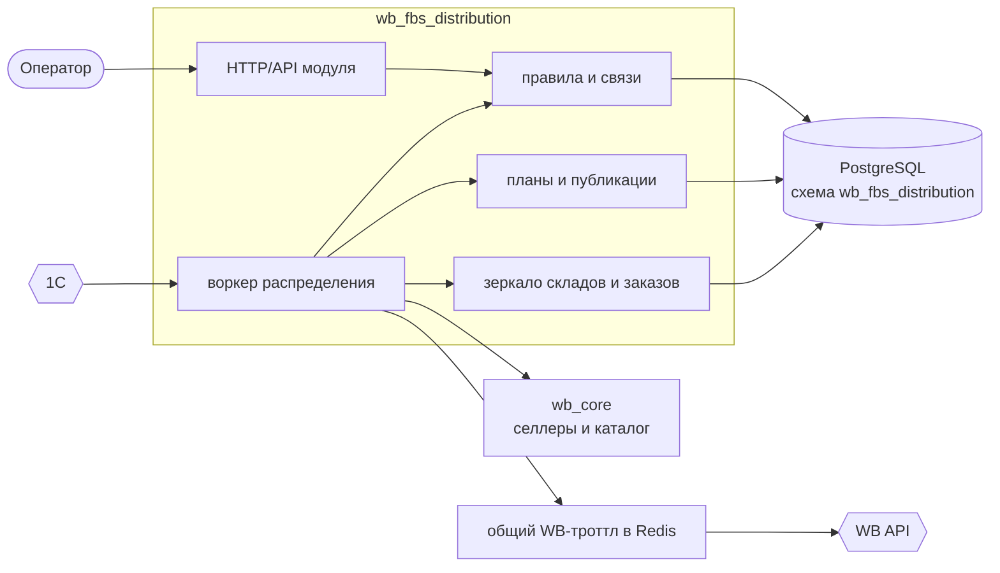

# Распределение остатков FBS

## Статус документа

Это проектное описание будущей автоматизации. Оно фиксирует:

- подтверждённые возможности Wildberries API;
- предлагаемую предметную модель и процесс;
- решения, которые можно принять уже сейчас;
- вопросы, которые ещё должен подтвердить логист или владелец 1С.

Пока автоматизация не пишет данные в Wildberries. Первый безопасный этап реализации —
зеркало складов и расчёт плана без публикации (`dry run`).

## Зачем

У продавца есть один физический пул товара в 1С, но Wildberries может принимать FBS-заказы
через разные склады и сортировочные центры. Чем больше подходящих направлений открыто, тем
шире география и потенциальная доступность товара покупателю.

Для каждого выбранного объекта WB создаётся **виртуальный склад продавца**. На виртуальных
складах публикуются части общего физического остатка. Одна физическая единица должна быть
назначена только одному виртуальному складу: если по 10 единиц показать на 69 складах, сервис
пообещает WB 690 единиц, которых в действительности нет.

Цель автоматизации:

1. поддерживать нужный набор виртуальных FBS-складов каждого селлера;
2. получать абсолютный физический остаток из 1С;
3. вычитать резерв на брак один раз на товар;
4. распределять доступные целые единицы между разрешёнными складами;
5. публиковать рассчитанные остатки в WB;
6. при необходимости учитывать новые FBS-заказы, не ожидая следующего обмена с 1С;
7. утром группировать новые сборочные задания в поставки, завершая работу до 10:00;
8. показывать оператору желаемое состояние, фактическое состояние WB и все расхождения.

## Что WB называет складом продавца

### Физический объект WB (`office`)

Склад или сортировочный центр Wildberries, куда продавец фактически отвозит готовые FBS-заказы.
WB отдаёт доступные объекты методом:

```text
GET https://marketplace-api.wildberries.ru/api/v3/offices
```

В ответе есть `id` (`officeId`), название, адрес, город, федеральный округ, координаты,
`cargoType`, `deliveryType` и признак `selected`.

### Виртуальный склад продавца (`warehouse`)

Учётная сущность внутри конкретного кабинета продавца. На ней нет отдельного физического товара:
она хранит заявленный продавцом остаток и указывает WB, через какой физический объект будет
исполнен заказ.

Каждый виртуальный склад обязательно связан с одним объектом WB через `officeId`.

Официально поддержаны методы:

```text
GET    /api/v3/warehouses                 список складов продавца
POST   /api/v3/warehouses                 создать склад продавца
PUT    /api/v3/warehouses/{warehouseId}   изменить название или привязку
DELETE /api/v3/warehouses/{warehouseId}   удалить склад продавца
```

Создание через API разрешено для FBS. Тело запроса:

```json
{
  "name": "FBS — Коледино",
  "officeId": 15
}
```

Успешный ответ `201` содержит `id` созданного склада продавца. Один и тот же объект WB нельзя
повторно привязать к другому виртуальному складу того же кабинета. Привязку существующего склада
можно менять не чаще одного раза в сутки.

Следовательно, создать около 69 виртуальных складов через WB API технически можно, если:

- каждый нужный `officeId` присутствует в `GET /api/v3/offices` и подходит для FBS;
- один `officeId` не используется дважды внутри кабинета;
- токен селлера имеет категорию «Маркетплейс» и право записи;
- нет недокументированного ограничения конкретного кабинета или тарифного ограничения;
- тип груза товара совместим с типом склада.

WB не документирует в рассмотренных методах общий максимум складов продавца. Поэтому число складов
нужно подтвердить пробным созданием в песочнице, если метод там поддержан, либо поэтапным запуском
на одном боевом кабинете. Сразу создавать полный набор во всех кабинетах нельзя.

### Что метод отдаёт на самом деле

Замер по боевому кабинету:

| Что | Сколько |
| --- | --- |
| объектов в `GET /api/v3/offices` | 180 |
| из них `cargoType = 1` (обычный груз) | 116 |
| из них `cargoType = 3` (КГТ) | 64 |
| `deliveryType` | у всех 1 |
| без `federalDistrict` | 20 |
| различных городов | 76 |
| `selected = true` | 16 |
| виртуальных складов в кабинете | 16 |

Числа 69 в ответе WB нет: доступных объектов 180, из них подходящих под обычный груз 116. Значит
69 — это выбор бизнеса из справочника, а не то, что можно вывести из API. Набор собирает оператор.

`selected` в точности совпал со списком уже созданных виртуальных складов, то есть означает «под
этот объект у кабинета склад уже есть». Признак зависит от ключа, которым спросили, поэтому в
общем зеркале справочника он не хранится, а выводится из складов кабинета.

Кабинет уже размечен вручную: склады названы `1. Москва Домодедово`, `2. Тагил ( ЕКБ)`,
`3. Новосибирск`, `4. Санкт Питербург`, `5. Казань`, `6. Краснодар` — это существующий порядок
приоритета, и он отличается от того, что назвал логист. Расхождение нужно снять до расчёта.

Официальные источники:

- https://dev.wildberries.ru/ru/openapi/work-with-products
- https://dev.wildberries.ru/knowledge-base/articles/019d49a0-ea5d-74b7-a147-be50f8dda5e9/kak-pol-zovat-sia-dokumentatsiei-wb-api
- https://dev.wildberries.ru/ru/openapi-other/sandbox-environment

## Где находится истина

Мы дублируем внешнее состояние в сервисе, но не объявляем нашу базу единственным источником всех
данных.

| Данные | Источник истины | Что хранит наш сервис |
| --- | --- | --- |
| Физический доступный остаток | 1С | последний принятый снимок, версия, время и результат валидации |
| Карточки, размеры, `nmID`, `chrtId` | каталог WB | локальный каталог в `wb_core` |
| Доступные объекты WB | WB `GET /api/v3/offices` | зеркало справочника и отметки оператора |
| Существующие виртуальные склады | WB `GET /api/v3/warehouses` | зеркало, привязки и последнее время сверки |
| Правила распределения | наш сервис | полная версия правил и история изменений |
| Количество на региональном ФФ | 1С, если есть разрез по местам хранения; иначе оператор | количество, дата актуальности, ответственный |
| Желаемый остаток на складах WB | наш сервис | рассчитанный план по `chrtId` и складу |
| Фактически опубликованный остаток | WB | последнее подтверждённое чтением значение |
| Новые сборочные задания | WB | локальная копия, резерв и состояние обработки |
| Поставки FBS | WB | локальная копия `supplyId`, состава и статуса |

Мы храним отдельно **желаемое** и **фактическое** состояние. Ответ `204` на обновление не означает,
что локальное число можно безусловно считать опубликованным: документация отдельно предупреждает,
что некорректные имена полей могут дать успешный ответ без изменения остатков. После записи нужна
выборочная или полная контрольная вычитка.

## Сущности

### Уже существующие в платформе

**Селлер** — кабинет продавца с зашифрованным API-ключом. Автоматизация подключается к селлеру,
но не владеет им.

**Артикул WB** — карточка с ключом `nmID`. В текущем `wb_core` поле называется `article`.

**Размер товара** — атомарная единица остатков WB с ключом `chrtId`. Даже у товара без привычной
размерной сетки WB создаёт размер. Остатки нужно писать по `chrtId`, а не по названию товара.

**Баркод (`sku`)** — внешний код размера. Он полезен для сопоставления с 1С, но не должен быть
главным ключом расчёта: у одного `chrtId` может быть несколько баркодов, а API WB переходит на
работу по `chrtId`.

### Новые сущности модуля

**Подключение селлера** — участие селлера в автоматизации и её общие настройки: включена ли запись,
интервалы, часовой пояс, допустимая давность 1С, режим `dry run`.

**Объект WB** — зеркальная запись `officeId` с названием, адресом, городом, округом, типом груза и
доставки, координатами и доступностью.

**Виртуальный склад** — пара `(seller_id, warehouseId)` и привязанный `officeId`. Дополнительно:
локальное название, активность, статус WB (`isProcessing`, `isDeleting`), участие в распределении,
приоритет и группа региона.

**Номенклатура 1С** — стабильный ID номенклатуры и, если нужно, ID характеристики. Название служит
только подписью и никогда не участвует в соединении данных.

**Пул остатка** — физически общий запас одной номенклатуры 1С. Он содержит `on_hand`, резервы 1С,
локальные временные резервы WB, резерв на брак и вычисленный доступный остаток. Резерв берётся
один раз на товар. Если 1С отдаёт остатки в разрезе мест хранения, доступное количество после
резерва делится между местами, а не резервируется в каждом заново.

**Связь товара** — соответствие пула 1С одному или нескольким `(seller_id, chrtId)`. Связь может
иметь долю или приоритет, если один физический товар продаётся через несколько карточек или
кабинетов.

**Группа взаимозаменяемости** — несколько карточек/баркодов, которые расходуют один физический
остаток. Нужна для случаев из таблицы логиста «один и тот же» и «другой артикул».

**Региональная группа** — одно из шести направлений (Москва, Приволжье, Краснодар, Урал,
Северо-Запад, Новосибирск), которому логист назначает процентную долю. Внутри группы склады
упорядочены и делят её долю поровну.

**Физический фулфилмент** — факт нахождения конкретного товара на региональном ФФ: город, внешний
склад, **количество**, дата актуальности, период действия и ответственный. Количество обязательно:
без него нельзя вычесть из московского пула то, что физически лежит в регионе. Сам по себе факт
ещё не определяет исключение — это делает правило.

**Правило доступности** — разрешает или запрещает продавать товар через конкретный склад, группу,
город или регион. Примеры: «не публиковать в Краснодаре», «только Москва и Казань», «полностью
выключить FBS».

**Политика распределения** — версия алгоритма для товара или группы товаров: резерв на брак,
региональные доли, порядок регионов и складов внутри них, `K` для малого остатка, правило деления
пула между кабинетами и стратегия округления.

**План распределения** — неизменяемый результат одного расчёта: входной остаток, применённые
правила, исключения и целое количество по каждой паре `(warehouseId, chrtId)`.

**Публикация остатка** — попытка привести WB к плану: пачка запроса, ответ, повтор, контрольное
чтение и расхождения.

**Сборочное задание** — одна заказанная единица FBS (`orderId`). Десять единиц товара создают
десять заданий; `orderUid` может объединять задания одной покупательской корзины.

**Локальный резерв** — временное уменьшение доступного пула после получения нового задания WB и
до того, как это движение гарантированно отражено в 1С.

**Поставка FBS** — группа сборочных заданий с `supplyId`. Состав поставки должен быть совместим по
складу назначения и габаритному типу.

**Прогон** — отдельный журнал синхронизации 1С, справочника складов, расчёта, публикации, вычитки
или сборки.

## Риск перепродажи между обменами с 1С

Пусть в 1С есть 53 единицы, распределённые между виртуальными складами. Покупатель заказывает
10 единиц. WB списывает их у себя сам, но 1С может узнать о заказе не сразу.

```text
10:00  1С: 53. Публикуем план на 53.
10:03  Заказ на 10. WB у себя списал -> на складах 43.
10:15  Обмен. 1С о заказе ещё не знает, отдаёт 53.
       Считаем план на 53 и делаем PUT -> возвращаем проданные 10 в продажу.
```

Наша запись перезаписывает списание WB. Поэтому всё зависит от того, за какое время заказ
доходит до 1С.

### Замер задержки WB → 1С

Задержку нужно измерить, а не предположить:

1. оформить тестовый заказ;
2. зафиксировать время появления заказа в WB;
3. зафиксировать время уменьшения остатка в 1С;
4. сравнить задержку с интервалом синхронизации.

Если 1С гарантированно обновляется раньше следующего цикла, локальные резервы не нужны и процесс
сводится к контуру сверки. Если задержка хотя бы иногда превышает интервал, нужен быстрый контур.

### Быстрый контур заказов (по результату замера)

1. Часто опрашивает `GET /api/v3/orders/new` по каждому подключённому селлеру.
2. Идемпотентно сохраняет новые `orderId`.
3. На каждое новое задание создаёт локальный резерв одной единицы соответствующего пула.
4. Немедленно пересчитывает распределение и уменьшает публикацию WB.
5. Снимает локальный резерв только после подтверждения, что движение уже учтено в абсолютном
   остатке 1С, либо после отмены с корректной сверкой.

### Контур сверки с 1С

1. Раз в 15 минут получает **абсолютный снимок**, а не дельту.
2. Проверяет версию, время источника, отрицательные значения и полноту справочника.
3. Сверяет локальные резервы с движениями, уже попавшими в 1С.
4. Пересчитывает все затронутые пулы.
5. Создаёт новый план и публикует только изменения.

Абсолютный снимок делает повтор безопасным: повторная доставка одного и того же сообщения не
списывает товар второй раз.

## Приём остатка из 1С

Обмена с 1С пока нет. Модуль ждёт его за портом `StockSnapshotSource`: транспорт не согласован, и
всё, что выше — проверка, пулы, расчёт — про него не знает. Сейчас за портом стоит заглушка
`DisconnectedSource`, которая честно отвечает «нечего взять»: без остатка 1С распределение не
считается, а выдумать его нельзя.

Пока обмена нет, снимок грузит оператор файлом — `POST /api/v1/wb/fbs/stock`, тело запроса это сам
CSV или JSON. Тело сырое, а не форма, чтобы будущий адаптер ходил тем же запросом.

Согласованный формат строки:

```text
item_id;barcode;name;characteristic;quantity;generated_at
```

Русские заголовки (`Код`, `Штрихкод`, `Наименование`, `Характеристика`, `Остаток`) принимаются
наравне с латинскими, кодировка UTF-8 или Windows-1251: пока формат 1С не утверждён, отказываться
от файла из-за заголовка — худшее, что можно сделать.

Снимок принимается целиком или не принимается вовсе. Отвергается, если:

- в нём нет ни одной строки — иначе пустой файл обнулил бы все пулы;
- есть отрицательный остаток;
- одна номенклатура с одной характеристикой встречается дважды;
- один баркод встречается дважды — он должен указывать на один размер карточки WB, иначе остаток
  задвоится при сопоставлении;
- время формирования в будущем дальше, чем на пять минут расхождения часов.

Отклонённые снимки тоже пишутся в журнал: «сегодня ничего не менялось» и «сегодня приехал битый
файл» — разные события, и второе оператор обязан видеть.

Пул, пропавший из свежего снимка, обнуляется, а не удаляется. В 1С товара больше нет, значит на WB
его должно стать ноль, но строка держит на себе сопоставление с карточкой, и терять его при каждой
пропаже нельзя.

## Сопоставление с карточками WB

Позиция 1С находит размер карточки по баркоду: в каталоге `wb_core` у каждого размера лежит `chrtId`
и список `skus` — это и есть баркоды, тринадцатизначные EAN. Проверено на боевом каталоге.

Связь хранится ключом `(seller_id, chrtId)`, а не баркодом: остатки WB пишутся по размеру, у размера
баркодов может быть несколько, и одна номенклатура 1С может быть заведена в нескольких кабинетах.
Баркод остаётся рядом как то, чем связь была найдена.

Пересопоставление кабинета переписывает его связи целиком. И каталог, и снимок 1С меняются, и связь,
потерявшая одну из сторон, обязана исчезнуть, а не указывать в пустоту.

Позиция, которой не нашлось размера, на WB не выгружается и показывается оператору ошибкой.

### Один баркод в нескольких кабинетах

Если баркод заведён в двух кабинетах, физический запас у них один. Без правила деления каждый
кабинет получил бы весь остаток, и вместе они пообещали бы WB кратное количество.

Поэтому такой пул из расчёта исключается, пока для него не задано правило: доли кабинетов должны
покрывать ровно те кабинеты, что расходуют пул, и складываться в сто процентов. Поровну по умолчанию
не делим — одинаковый баркод ещё не значит, что запас пополам; это решение бизнеса. Кнопка
«разделить поровну» в интерфейсе есть, но нажать её должен человек.

## Формула доступного остатка

```text
reserve   = min(R, max(0, on_hand - R))
available = max(0, on_hand - reserved_1c - reserve)
```

`R` — резерв на брак, начальное значение 20 единиц. Формула короче записывается как
`available = min(on_hand, max(R, on_hand - R))` и ведёт себя так:

```text
остаток <= 20   резерв не берётся вовсе, распределяем всё
остаток 21..40  резерв добирается постепенно, доступно остаётся 20
остаток > 40    резерв ровно 20
```

```text
остаток    1 -> резерв   0 -> доступно    1
остаток   10 -> резерв   0 -> доступно   10
остаток   20 -> резерв   0 -> доступно   20
остаток   21 -> резерв   1 -> доступно   20
остаток   30 -> резерв  10 -> доступно   20
остаток   40 -> резерв  20 -> доступно   20
остаток   41 -> резерв  20 -> доступно   21
остаток   88 -> резерв  20 -> доступно   68
остаток   89 -> резерв  20 -> доступно   69
остаток  100 -> резерв  20 -> доступно   80
остаток 1000 -> резерв  20 -> доступно  980
```

Почему не «вычитаем 20, а на остатке ≤ 20 не вычитаем ничего»: такое правило разрывно. Остаток 20
дал бы 20 доступных, а остаток 21 — всего одну. Продавец с бо́льшим запасом показывал бы на WB
меньше товара. Приведённая формула даёт тот же результат на всех числах, которые называл бизнес,
но растёт монотонно: доступное количество никогда не уменьшается при росте остатка.

Резерв вычитается **один раз на товар**, а не на `chrtId`, не на кабинет и не на место хранения.
Если 1С отдаёт остатки в разрезе мест хранения, резерв всё равно берётся один раз от суммы по
товару, после чего доступное количество делится между пулами мест хранения.

Товар с нулевым доступным количеством не пропускается, а публикуется нулями на все свои склады.
Иначе ранее опубликованные остатки останутся в WB навсегда.

Нужно подтвердить, что поле, которое логист называет «остатком 1С», ещё не вычитает резервы. Если
1С уже отдаёт свободный остаток, второе вычитание `reserved_1c` недопустимо.

`R` — настройка политики с областью действия: глобально, по селлеру, категории или товару. В коде
она не зашивается.

## Три уровня распределения

### 1. Физический пул между кабинетами

Один баркод может продаваться в нескольких кабинетах из одного физического запаса. Если каждый
кабинет получит полный `available`, сервис пообещает WB кратное количество.

Поэтому `available` сначала делится между кабинетами по явно настроенному правилу: фиксированные
проценты, равные доли или индивидуальные значения. Делить поровну по умолчанию нельзя — это
должно быть выбранной политикой, а не догадкой по совпадению баркода.

### 2. Остаток кабинета между карточками

Внутри кабинета один пул может питать несколько `chrtId`. Для связи задаются веса или приоритет.

### 3. Остаток карточки между виртуальными складами

Для каждого `chrtId` строится множество **разрешённых** складов:

1. склад существует в WB и не удаляется;
2. обработка создания или изменения завершена;
3. склад включён оператором;
4. `cargoType` совместим с товаром;
5. склад не исключён правилом товара или региональным ФФ;
6. политика селлера разрешает этот регион;
7. логистика действительно может отвезти заказ в привязанный объект WB.

Далее `N` — количество разрешённых складов, `A` — доступное количество карточки.

## Алгоритм распределения по складам

Порог полного покрытия — не константа 69, а само `N`. Если для товара разрешено 64 склада, полное
покрытие включается с 64 единиц.

### A >= N: полное покрытие

Логист называет доли **от всего остатка**, а не от какой-то его части. Поэтому проценты
применяются первыми, а минимум в одну единицу добирается после них:

1. весь `A` делится между шестью региональными группами по процентным долям;
2. доля группы делится поровну между её разрешёнными складами;
3. склады, получившие ноль, поднимаются до единицы; недостающие единицы забираются у самого
   крупного получателя, и донор выбирается заново на каждой единице;
4. инвариант: сумма равна `A`, каждый разрешённый склад имеет не меньше единицы.

Донор всегда найдётся: если бы у всех ненулевых складов была ровно единица, сумма оказалась бы
меньше `N`, а `A >= N` по условию ветки.

Порядок операций важен. Если сначала раздать по единице, а проценты применить к остатку сверх
минимума, заявленные доли перестают выполняться: база из `N` единиц съедает бо́льшую часть
небольшого остатка раньше, чем проценты вообще начнут работать. При долях к полному `A` расчёт
держится близко к заявленному:

```text
N = 69, складов Москвы 5, доля Москвы 40%

A = 69   -> Москве   5 =  7,2%   все склады получают ровно по единице, выбора нет
A = 100  -> Москве  30 = 30,0%
A = 200  -> Москве  78 = 39,0%
A = 1000 -> Москве 400 = 40,0%
```

Состав остальных пяти групп в примере условный: сколько единиц уйдёт на подъём нулевых складов,
зависит от того, как 69 СЦ разложены по направлениям. Точные числа пересчитаются, когда логист
даст состав групп и доли.

На `A = N` доли недостижимы по определению: единственное распределение, где каждому досталось не
меньше единицы, — это по единице каждому. Дальше расхождение быстро исчезает.

Доли задаёт логист для шести направлений, а не для 69 складов по отдельности: Москва, Приволжье,
Краснодар, Урал, Северо-Запад, Новосибирск.

Если в группе не осталось ни одного разрешённого склада, её доля перераспределяется между
остальными группами пропорционально их долям. Иначе сумма плана окажется меньше `A`.

### A < N: приоритетные склады

Весовая схема на малых числах теряет смысл, включается стратегия приоритета. `K` считается **в
регионах**: смысл правила в том, чтобы малый остаток попал в разные направления, а не осел в
нескольких московских СЦ.

Поэтому упорядоченный список складов строится обходом по кругу, а не группами подряд:

```text
Москва #1, Приволжье #1, Краснодар #1, Урал #1, Северо-Запад #1, Новосибирск #1,
Москва #2, Приволжье #2, ...
```

При таком порядке «первые `K` складов» и «по одному складу из первых `K` регионов» — одно и то же,
пока `K` не превышает число групп, а при большем `K` правило продолжается вторым кругом без
отдельного исключения.

Дальше:

1. берутся первые `K` складов этого списка, `K` настраивается, начальное значение 3;
2. `A` делится между ними поровну;
3. остаток от деления получают склады с более высоким приоритетом;
4. если `A < K`, задействуются только первые `A` складов, по одной единице;
5. ни один склад не получает фиктивную единицу.

Примеры для `K = 3`, то есть первый склад Москвы, Приволжья и Краснодара:

```text
A = 16 -> 6 / 5 / 5
A = 15 -> 5 / 5 / 5
A = 10 -> 4 / 3 / 3
A = 4  -> 2 / 1 / 1
A = 2  -> 1 / 1 / 0
```

Если склад запрещён для товара, берётся следующий разрешённый по тому же круговому порядку.

### Разрыв на пороге

Правило разрывно по построению:

```text
A = N - 1 -> три склада, например 23 / 23 / 22
A = N     -> все N складов по одной единице
```

Одна единица прироста схлопывает московский СЦ с 23 до 1. Это осознанное следствие выбранного
бизнес-правила, а не дефект расчёта. Если позже понадобится плавный переход, его даёт лестница
вида «число складов растёт вместе с остатком»; она вводится отдельной стратегией политики.

## Целочисленное округление

WB принимает целое `amount`. Дробные результаты публиковать нельзя.

Везде, где доля делится на части, применяется метод наибольших остатков:

1. вычислить точную дробную квоту;
2. взять целую часть каждой квоты;
3. оставшиеся единицы раздать по убыванию дробной части;
4. при равенстве использовать явный приоритет склада или региона;
5. проверить инвариант: сумма результата равна распределяемому количеству.

Пример деления 11 единиц между направлениями с долями 40/25/20/10/5:

```text
квоты:      4.40 / 2.75 / 2.20 / 1.10 / 0.55
пол:        4    / 2    / 2    / 1    / 0
остаток: две единицы -> наибольшие дробные части (2.75 и 0.55)
результат:  4    / 3    / 2    / 1    / 1
```

Метод применяется дважды: при делении `A` между группами и при делении доли группы между её
складами. Подъём нулевых складов до единицы выполняется после обоих делений и сумму не меняет.

## Что делает расчёт

Расчёт по кабинету собирает план и сохраняет его. В WB не уходит ничего: план — это `dry run`,
публикация будет отдельным этапом и отдельным правом.

Для каждой связи «пул 1С → размер карточки»:

1. из остатка пула вычитается резерв на брак;
2. если пул делят несколько кабинетов, берётся доля этого кабинета;
3. доступное количество раскладывается по очереди разрешённых складов.

Из очереди выбывают склады, которые WB ещё создаёт или уже удаляет: публикация на них будет
отклонена, а учёт их в расчёте отдал бы им долю, которую они не примут.

Размер, не попавший в план, получает причину, а не молчание — «пропущен» и «товара нет» это разные
вещи, и чинятся они по-разному:

| Причина | Что значит |
| --- | --- |
| `no_stock` | после резерва раздавать нечего |
| `no_warehouses` | у кабинета нет складов в очереди |
| `shares_missing` | остатка хватает на все склады, но доли направлений не заданы |
| `pool_split_missing` | запас делят несколько кабинетов, правила деления нет |
| `pool_missing` | позиции нет в текущем снимке 1С |

План неизменяем и хранит входной снимок и версию чисел, по которым считался. Без этого через
полгода нечем ответить, почему вчера на складе было опубликовано 47.

## Физические фулфилменты

Товар может уехать на региональный фулфилмент. Тогда этот регион обслуживает ФФ, а московский
склад не должен дополнительно обещать товар в тот же регион: соответствующие сортировочные центры
исключаются из распределения московского остатка.

Если товар на региональный ФФ не уезжал, московский склад покрывает все разрешённые регионы,
включая тот, где такой ФФ существует.

Одного признака «товар на ФФ» недостаточно — нужно **количество**. Если 1С отдаёт один общий
остаток, а 50 единиц физически лежат в Краснодаре, то, исключив краснодарские склады, мы всё равно
распределим все 100 единиц по остальным и пообещаем из Москвы товар, которого там нет.

Возможны два устройства:

- **1С отдаёт остатки по местам хранения.** Резерв берётся один раз от суммы по товару, доступное
  количество делится между местами, исключения выводятся из данных, ручной учёт не нужен.
- **1С отдаёт один общий остаток.** Нужна отдельная таблица: товар, региональный ФФ, количество,
  дата актуальности, ответственный. Количество вычитается из московского пула.

В обоих случаях факт и правило разделяются:

- факт: столько-то единиц находится или планируется на ФФ в городе;
- правило: исключить конкретные склады, регион целиком либо выключить товар из распределения;
- период: с какой даты действует и когда заканчивается;
- источник и ответственный: кто обновил информацию.

Точная связь региональных ФФ с сортировочными центрами и количества — от Леры.

## Жизненный цикл виртуальных складов

### Первичное подключение селлера

1. Оператор подключает селлера к автоматизации.
2. Сервис проверяет категорию и права токена без записи.
3. Загружает каталог WB и проверяет наличие `chrtId`.
4. Получает `offices` и уже существующие `warehouses`.
5. Сопоставляет существующие склады по `warehouseId`/`officeId`, а не по имени.
6. Оператор выбирает целевой набор объектов WB.
7. Сервис показывает план: что будет использовано, создано, переименовано или конфликтует.
8. В `dry run` рассчитывается распределение, но в WB ничего не меняется.
9. После отдельного включения записи сервис создаёт отсутствующие склады по одному, фиксируя
   каждый ответ.
10. Пока `isProcessing=true`, склад не участвует в публикации.
11. На новом складе сначала публикуется нулевой/безопасный набор, затем рабочий план.

### Ежедневная сверка

- получить `offices` и `warehouses`;
- обновить зеркало;
- пометить исчезнувшие или недоступные объекты;
- обнаружить ручные изменения в кабинете WB;
- не исправлять опасные расхождения автоматически без заданной политики.

### Обновление и удаление

Изменение `officeId` ограничено WB одним разом в сутки. Поэтому перепривязка выполняется отдельной
командой, а не обычной фоновой сверкой.

Удаление склада — разрушительная операция. Автоматизация не удаляет склад только потому, что он
исчез из локального целевого списка. Сначала публикуется ноль, проверяется отсутствие новых
заданий и активных зависимостей, затем оператор отдельно подтверждает удаление.

## Право писать в кабинет

Запись выключена по умолчанию на каждом кабинете. Подключение к автоматизации само по себе его не
даёт: между ошибочным нажатием и живым кабинетом стоит только этот флаг, и включает его оператор
отдельным действием по одному кабинету — пилот идёт не на всех сразу.

Команды, меняющие кабинет, живут в отдельном клиенте от читающего. Чтение справочника делает
фоновая сверка каждые сутки; запись меняет чужой кабинет и запускается только руками. Пока они в
одном объекте, ничто не мешает сверке однажды вызвать не тот метод.

Проверки до обращения к WB, а не после его отказа:

- второй склад под тем же объектом не создаётся — WB это запрещает, но его ответ ничего не объяснит
  оператору;
- перепривязка на занятый объект отклоняется там же;
- склад, ещё участвующий в распределении, не удаляется: сначала надо вывести его из схемы, чтобы
  расчёт перестал на него рассчитывать, а на WB уехали нули.

Склады создаются по одному, а не пачкой на весь целевой набор: WB не документирует общий максимум
складов продавца, и упереться в него на сороковом из шестидесяти лучше с сорока созданными, чем с
непонятной ошибкой посреди цикла. После каждой команды зеркало сверяется сразу.

## Публикация остатков в WB

Основной метод:

```text
PUT /api/v3/stocks/{warehouseId}
```

Тело содержит от 1 до 1000 записей:

```json
{
  "stocks": [
    {"chrtId": 12345678, "amount": 10}
  ]
}
```

Процесс публикации:

1. зафиксировать неизменяемый план и его входную версию 1С;
2. сравнить план с последним подтверждённым фактом WB;
3. не отправлять неизменившиеся пары;
4. сгруппировать изменения по `warehouseId`, пачками до 1000 `chrtId`;
5. соблюдать общий Redis-троттл платформы;
6. записать ответ и идентификатор попытки;
7. после успеха прочитать остатки через `POST /api/v3/stocks/{warehouseId}`;
8. отметить план применённым только после совпадения;
9. при появлении более свежего плана не публиковать устаревшие ретраи.

Нормальное обнуление выполняется `PUT amount=0`. Метод `DELETE` удаляет саму запись остатка,
назван документацией необратимым и имеет существенно более низкий лимит; для регулярной работы
он не нужен.

Инварианты перед записью:

```text
amount — целое и amount >= 0
sum(amount по всем складам и карточкам пула) <= available пула
каждый chrtId принадлежит нужному селлеру
склад принадлежит тому же селлеру
план построен по актуальной версии правил
источник 1С не просрочен
```

## Сборочные задания и формирование поставок

WB создаёт одно сборочное задание на одну заказанную единицу. Новые задания получаем методом:

```text
GET /api/v3/orders/new
```

Утренний процесс:

1. выбрать необработанные новые задания;
2. разделить их по селлеру;
3. сгруппировать по складу назначения (`officeId`) и `cargoType`;
4. на каждую группу создать поставку `POST /api/v3/supplies`;
5. добавить задания в поставку
   `PATCH /api/marketplace/v3/supplies/{supplyId}/orders`;
6. WB автоматически переведёт задания из `new` в `confirm` («на сборке»);
7. передать необходимую информацию в 1С;
8. сохранить `supplyId`, состав и результат;
9. далее дать оператору стикеры, метаданные, QR и пропуск как отдельные сценарии.

`cargoType` входит в ключ группировки, даже если сейчас в ассортименте только обычные товары:
несовместимые габариты нельзя класть в одну поставку, и модель не должна этого допускать.

WB возвращает `officeId` в сборочных заданиях и `destinationOfficeId` в поставке; эти значения
должны совпадать, иначе при добавлении задания возможен `409`.

Каждый созданный виртуальный склад обрабатывается отдельно: заказы фильтруются по складу, а не
сваливаются в одну поставку на весь кабинет.

Работу нужно завершать до 10:00 по Москве — к этому времени Лера передаёт поставки. Время старта
задаётся конфигурацией с запасом на повторы. Второй ежедневный запуск обсуждался ранее, но
последним требованием не подтверждён: место под него в конфигурации есть, включение — по решению
бизнеса.

Если задание не удалось добавить, оно остаётся необработанным для повторной попытки и видно
оператору.

Официальные источники:

- https://dev.wildberries.ru/openapi/orders-fbs/
- https://dev.wildberries.ru/knowledge-base/articles/019d49a4-0771-7571-aea9-11d5b597f34c/zakazy-fbs

## Архитектура в текущем сервисе

Автоматизация должна быть новым модулем `wb_fbs_distribution`, а не расширением оборачиваемости.
Оборачиваемость читает заявленные остатки; новый модуль ими управляет. Смешение чтения аналитики
и команд записи сделает права, ошибки и жизненный цикл неразделимыми.



Модуль получает селлера и каталог через порты `wb_core`, не джойнит его таблицы. Он реализует
стандартный порт подключения (`seller_ids`, `attach`, `detach`, `purge`).

Существующий клиент оборачиваемости уже умеет читать `GET /api/v3/warehouses` и
`POST /api/v3/stocks/{warehouseId}` по `chrtId`. Код записи и управления складами должен жить в
новом клиенте/порту с явным разделением read/write, но использовать общий HTTP-клиент, шифрование
ключей и Redis-троттл.

### Предлагаемые таблицы

| Таблица | Назначение |
| --- | --- |
| `tracked_sellers` | подключение, режим записи, интервалы, TTL 1С |
| `wb_offices` | зеркало доступных объектов WB |
| `warehouse_groups` | шесть региональных групп и порядок складов внутри группы |
| `region_shares` | процентные доли шести направлений |
| `seller_warehouses` | зеркало виртуальных складов и настройки участия |
| `stock_pools` | физические пулы номенклатуры 1С |
| `pool_seller_shares` | правило деления пула между кабинетами |
| `stock_snapshots_1c` | принятые абсолютные снимки и версия источника |
| `product_mappings` | связь пула с `seller_id` и `chrtId` |
| `fulfillment_presence` | количество товара на региональном ФФ, дата актуальности, ответственный |
| `distribution_policies` | версии резерва, долей, `K` и стратегии малого остатка |
| `eligibility_rules` | разрешения и запреты товара и склада |
| `allocation_plans` | заголовки неизменяемых планов |
| `allocation_items` | целевые количества по складу и `chrtId` |
| `stock_publications` | пачки записи, ответы и контрольное чтение |
| `assembly_orders` | зеркало новых заданий и локальные резервы |
| `supplies` / `supply_orders` | созданные поставки и их состав |
| `runs` | журнал всех фоновых процессов |

Историю входных снимков можно хранить ограниченно, но планы, публикации и действия оператора
нужны для аудита: без них невозможно ответить, почему вчера на складе было опубликовано 47.

## Интерфейс оператора

### Обзор

- режим: `dry run`, запись включена, приостановлено, ошибка;
- свежесть 1С и WB;
- физический доступный остаток;
- сумма желаемого и фактического FBS-остатка;
- число активных складов, товаров без связи и расхождений;
- последний успешный расчёт, публикация и вычитка.

### Склады

- зеркало объектов WB и виртуальных складов;
- `officeId`, `warehouseId`, город, адрес, округ, тип груза;
- региональная группа, доля группы и порядок склада внутри неё;
- участие, приоритет, статус создания и удаления;
- план создания до выполнения;
- отдельные команды создания, перепривязки и удаления.

### Товары и правила

- товар 1С и связанный `nmID`/`chrtId`/баркоды;
- общий пул нескольких карточек и кабинетов, доля каждого кабинета;
- резерв на брак и доступное количество после него;
- количество на региональном ФФ и дата актуальности;
- разрешённые и запрещённые склады;
- региональные доли и приоритеты;
- объяснение текущего расчёта: какой снимок, какая версия правил, почему столько.

### Планы и расхождения

- входной остаток и его время;
- применённая версия политики;
- желаемое и фактическое количество по складам;
- изменения относительно предыдущего плана;
- ошибки и безопасный ручной повтор.

### Сборка

- новые задания, локальные резервы и задания без сопоставления;
- утренняя группировка по селлеру, складу назначения и `cargoType`;
- состав, `supplyId`, склад назначения, габарит и статус;
- запас времени до дедлайна 10:00 и задания, которые не удалось добавить.

## Расписание

Предлагаемая начальная конфигурация:

| Периодичность | Процесс |
| --- | --- |
| каждые 15 минут | абсолютный снимок 1С, расчёт и публикация изменений |
| каждые 15 минут после записи | контрольная вычитка изменённых остатков |
| раз в сутки | полная сверка `offices` и `warehouses` |
| утро, с завершением до 10:00 МСК | группировка заданий в поставки |
| второй запуск поставок | место в конфигурации есть, необходимость не подтверждена |
| каждая 1 минута | новые задания и локальные резервы — включается только если замер покажет, что 1С узнаёт о заказе позже следующего цикла |

Расписание хранится в настройках. Московское время нельзя подразумевать в базе: моменты хранятся
в UTC, а бизнес-расписание — с явным часовым поясом.

Без изменения кода настраиваются: резерв на брак, `K` для малого остатка, региональные доли,
порядок регионов, порядок складов внутри региона, правило деления пула между кабинетами, частота
обмена с 1С, расписание выгрузки и время формирования поставок.

## Состояния и безопасное поведение

| Ситуация | Поведение |
| --- | --- |
| Нет связи товара 1С с `chrtId` | не публиковать товар, показать ошибку сопоставления |
| Остаток 1С отрицательный | считать вход невалидным, не публиковать отрицательное значение |
| Снимок 1С немного просрочен | короткий настраиваемый grace period, предупреждение |
| Снимок просрочен больше TTL | безопасная политика должна быть выбрана бизнесом: ноль или стоп с последним значением |
| Новый заказ уже сохранён | повтор `orderId` ничего не резервирует второй раз |
| WB `401/403` | постоянная ошибка токена, остановить запись селлера |
| WB `406` | обновление остатка заблокировано, остановить затронутую публикацию |
| WB `409` | не крутить быстрые ретраи; перечитать состояние и классифицировать конфликт |
| WB `429/5xx`/сеть | отложенный повтор с backoff через общий троттл |
| Ответ `204`, факт не совпал | статус `drift`, повтор только по актуальному плану |
| Склад `isProcessing` | не публиковать до готовности |
| Ручное изменение в WB | показать drift; автокоррекция только если политика разрешает |
| Новый план появился во время ретрая | старый план становится superseded и не отправляется |

Коды `409` учитываются WB как десять запросов, поэтому повторять конфликт в цикле особенно опасно.

## Лимиты WB

По текущей документации методы складов и обычные методы остатков имеют бюджет 300 запросов в
минуту на аккаунт, интервал 200 мс и burst 20. Один `409` считается десятью запросами. Метод
удаления записей остатков имеет отдельный низкий лимит: 10 запросов в минуту, интервал 6 секунд,
burst 2.

Нельзя превращать эти числа в локальную константу отдельного воркера. Новый модуль использует уже
существующий общий Redis-троттл по токену и категории API, чтобы не конкурировать вслепую с
оборачиваемостью и другими Marketplace-запросами.

## Этапы реализации

### Этап 0. Подтверждение процесса

- получить интерфейс, поля и разрез остатка 1С;
- измерить задержку WB → 1С тестовым заказом;
- получить полный список целевых `officeId` и разложить его по шести региональным группам;
- получить порядок складов внутри групп и региональные доли;
- уточнить правила и количества региональных ФФ;
- определить селлеров и товары первого запуска.

### Этап 1. Зеркало и `dry run`

- новый модуль, схема и подключение селлера;
- чтение `offices`, `warehouses`, каталога и остатков;
- приём снимка 1С;
- сопоставление товаров по баркоду и ручное разрешение конфликтов;
- расчёт целочисленного плана без записи;
- экран объяснения и расхождений.

### Этап 2. Управление складами

- региональные группы, приоритеты и доли;
- план создания;
- создание малого пилотного набора;
- отслеживание `isProcessing`;
- сверка привязок и безопасные административные команды.

### Этап 3. Публикация остатков

- запись только для одного пилотного селлера;
- не более нескольких складов и товаров;
- контрольное чтение после каждого плана;
- затем постепенное расширение до полного набора.

### Этап 4. Быстрый контур заказов

Включается только если замер из этапа 0 показал, что 1С узнаёт о заказе позже цикла обмена.

- зеркало `orders/new`;
- локальные резервы;
- отмены и сверка резервов.

### Этап 5. Утреннее формирование поставок

- группировка по селлеру, складу назначения и `cargoType`;
- создание поставок и добавление заданий;
- передача информации в 1С;
- стикеры, маркировка и пропуска — отдельными подэтапами по необходимости.

## Что должно быть подтверждено до записи в WB

Интеграция с 1С:

1. Интерфейс: кто инициатор, протокол, аутентификация и сетевая доступность из внутреннего
   контура (сейчас он ходит наружу только в WB, см. `docs/architecture/NETWORK_AND_EGRESS.md`).
2. Семантика остатка: физический или уже свободный после резервов.
3. Разрез остатка: одно число на товар или в разрезе мест хранения.
4. Абсолютный снимок или дельта.
5. Стабильные идентификаторы номенклатуры и характеристики.
6. Формат обратной передачи информации о поставках.
7. Измеренная задержка появления заказа WB в 1С.

Правила бизнеса:

8. Полный список целевых `officeId` и их распределение по шести региональным группам: WB отдаёт
   180 объектов, отбор делает бизнес.
9. Порядок складов внутри каждой группы.
10. Региональные доли шести направлений, включая повышенную долю Москвы.
11. Связь региональных ФФ с сортировочными центрами и количества на них — от Леры.
12. Пересечения баркодов между кабинетами и правило деления пула.
13. Политика просроченного или недоступного остатка 1С: обнулять или держать последнее значение.
14. Время старта утреннего формирования поставок и необходимость второго запуска.
15. Требования к маркировке, стикерам, коробам и пропускам.

Ограничения WB:

18. Реальная возможность создать нужное число виртуальных складов в кабинете — проверяется
    пилотом, документацией не гарантирована.
19. Реальная возможность логистики сдавать заказы в каждый из целевых сортировочных центров.

## Принятые на уровне архитектуры решения

- 1С остаётся источником физического остатка; WB — источником своих складов и заданий.
- Наш сервис владеет правилами, планом и аудитом.
- Главный ключ остатков WB — `chrtId`, не название и не баркод.
- Резерв на брак вычитается один раз на товар, до любого деления между местами хранения,
  кабинетами, карточками и складами.
- Резерв не берётся, пока остаток не превышает его самого, и добирается постепенно: доступное
  количество монотонно растёт вместе с остатком.
- Порядок деления: пул между кабинетами, кабинет между карточками, карточка между складами.
- Порог полного покрытия — число разрешённых складов товара, а не константа 69.
- При полном покрытии проценты применяются ко всему доступному количеству, и только затем
  нулевые склады поднимаются до единицы за счёт самых крупных получателей.
- Региональные доли задаются шести направлениям, внутри направления склады делят долю поровну.
- `K` для малого остатка считается в регионах: список складов упорядочен обходом по кругу, по
  одному складу из каждого направления.
- Сумма публикации никогда не превышает доступный остаток пула.
- Все количества целые; округление — метод наибольших остатков, детерминированный и сохраняющий
  сумму.
- Товар с нулевым доступным количеством публикуется нулями, а не пропускается.
- Обычное выключение товара — `amount=0`, а не `DELETE` записи остатка.
- Быстрый контур заказов включается по результату замера задержки WB → 1С, а не по умолчанию.
- Поставки группируются по селлеру, складу назначения и `cargoType`.
- Запись в WB начинается только после `dry run` и пилота на одном кабинете.
- Управление складами и остатками идемпотентно: сначала читаем факт, затем применяем разницу.
- Каждая запись объяснима входным снимком, версией правил и неизменяемым планом.
