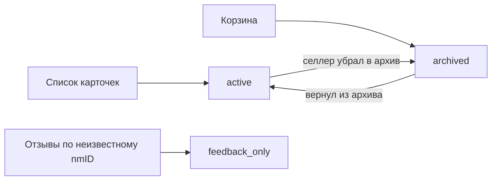

# Артикулы

## Чем товар опознаётся

- Ключ товара — **`nmID`**. Он же связывает каталог и отзывы.
- `vendorCode` уникален в рамках селлера, но селлер его меняет — годится как метка, не как
  ключ.
- `title` идентификатором **не является**: у одного селлера бывает 33 уникальных названия
  на 317 артикулов, потому что все карточки склейки называются одинаково.
- `imtID` — идентификатор склейки. Карточка на сайте WB показывает отзывы всей склейки,
  поэтому по отзывам ведутся две серии: по артикулу и по склейке. Совпадения с сайтом до
  единицы не будет — мы считаем и отзывы, исключённые WB из публичного рейтинга.

## Состояния

Каталог WB не возвращает архивные карточки в общем списке, поэтому одного флага «есть или
нет» мало. Состояние принимает три значения:

| Состояние | Значит |
| --- | --- |
| `active` | пришла из списка карточек |
| `archived` | пришла из корзины |
| `feedback_only` | нет ни там, ни там, но по ней есть отзывы |

`feedback_only` — не ошибка и не мусор: у старого товара, снятого с продажи, отзывы
остаются, и терять их историю нельзя.

## Кто выставляет состояние

**Только каталог-синк.** Обработчик отзывов регистрирует ранее неизвестные артикулы, но
существующие строки не трогает — иначе два синка перезаписывали бы статус друг друга и
товар «мигал» между активным и архивным.

Если корзина недоступна, мы понижаем только активные карточки: отличить «в архиве» от
«удалено» в этот момент невозможно, и объявлять товар архивным на основании недоступности
API — значит врать в интерфейсе.

## Откуда берутся размеры и баркоды

Из каталога. Остатки FBS запрашиваются по баркодам, и брать их заново у WB на каждом
слоте — лишние запросы к API, у которого и так узкий бюджет.
